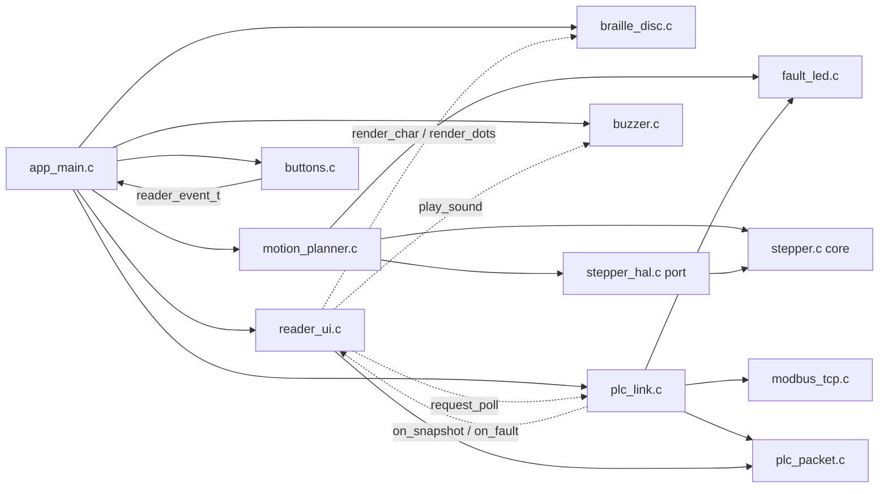

# 1. Architecture layers

The codebase has five layers stacked on top of the physical chip. Each layer
only talks to the one directly below it. Once you can place a file in this
stack, you know what it's allowed to assume and what it's not.

```
┌─────────────────────────────────────────────────────────────────┐
│ App/                     your code: orchestration + own modules │
│   app_main.c/.h            App_init / App_run — one wiring per   │
│                              input variant, see 06-usb-cdc.md     │
│   braille_disc.c/.h         character/dots → cell →               │
│                              two disc angles                    │
│   motion_planner.c/.h       owns both motors: driver bring-up,   │
│                              angle→microstep moves, homing       │
│   stepper.h/.c              portable STEP/DIR core (no MCU)      │
│   stepper_hal.h/.c           STM32 port for stepper.h (TIM+GPIO) │
│   reader_ui.c/.h             cursor, pending slot, dwell timing  │
│   plc_link.c/.h              W5500 bring-up + MODBUS poll cycle  │
│   plc_packet.c/.h            packet contract, and modbus_tcp.c/.h│
│    + modbus_tcp.c/.h           MBAP/PDU codec — both pure logic  │
│   buttons.c/.h + buzzer.c/.h  debounced input + blocking tones,  │
│    + fault_led.c/.h            plus the shared LED blink codes   │
├─────────────────────────────────────────────────────────────────┤
│ Lib/tmc2209/             vendored driver library (3rd-party-ish)│
│   tmc2209.h/.c              portable TMC2209 protocol/register   │
│                              logic (no MCU headers)              │
│   tmc2209_stm32.h/.c         STM32 port for tmc2209.h (CMSIS)    │
├─────────────────────────────────────────────────────────────────┤
│ Lib/w5500/               vendored WIZnet ioLibrary, Ethernet/   │
│                           tree only (3rd-party-ish)               │
│   wizchip_conf.c, socket.c,  portable chip/socket logic          │
│    W5500/w5500.c                (no MCU headers)                 │
│   w5500_stm32.c/.h           STM32 port: SPI2 + CS + reset (HAL) │
├─────────────────────────────────────────────────────────────────┤
│ Middlewares/ + USB_DEVICE/  ST's USB Device Library (vendor) +   │
│                              CubeMX glue + your CDC callbacks —   │
│                              linked only in the USB_CDC variant   │
├─────────────────────────────────────────────────────────────────┤
│ Core/                    CubeMX-generated boilerplate            │
│   main.c                    entry point, calls App_init/App_run  │
│   gpio.c, usart.c, tim.c, spi.c   peripheral init via ST HAL     │
│   stm32f1xx_it.c            interrupt vector bodies              │
├─────────────────────────────────────────────────────────────────┤
│ Drivers/STM32F1xx_HAL_Driver   ST's HAL: HAL_GPIO_Init,          │
│                                 HAL_TIM_PWM_Start_IT, HAL_Delay… │
├─────────────────────────────────────────────────────────────────┤
│ Drivers/CMSIS            ARM core + ST device headers: struct    │
│                           layouts for GPIOA->BSRR, USART2->SR,   │
│                           TIM2->ARR — i.e. the register map      │
├─────────────────────────────────────────────────────────────────┤
│ Silicon: STM32F103 (Cortex-M3), TMC2209 driver chips, W5500      │
└─────────────────────────────────────────────────────────────────┘
```

The App/ box above has nine module rows now, not the original five. Six of
them — `reader_ui`, `plc_link`, `plc_packet`, `modbus_tcp`, `buttons`,
`buzzer` — are new behaviour for the default MODBUS build. A seventh,
`fault_led`, is not new behaviour at all: it is the pre-existing blink-code
logic pulled out of `motion_planner.c` so a third caller (`plc_link.c`) can
report a boot-time fault without depending on the motor code. Full breakdown
of all seven: [09-modbus-tcp-and-plc-link.md](09-modbus-tcp-and-plc-link.md)
and [10-reader-ui-and-buzzer.md](10-reader-ui-and-buzzer.md).

One caveat about the drawing: the USB stack is stacked in for tidiness, but it
is not something the App layer calls *down* into. It runs on its own interrupt
and hands characters *up* to `App_run()` through a ring buffer — a peer
producer, not a dependency. Everything else in the diagram is a strict
"the layer above calls the layer below" relationship.

## Layer by layer

### CMSIS (`Drivers/CMSIS`) — the register map

Not code you run, mostly `#define`s and `struct` layouts. `GPIO_TypeDef`,
`USART_TypeDef`, `TIM_TypeDef`, `RCC` — these are C structs whose members are
placed at the exact memory offsets the datasheet specifies, so that
`GPIOA->BSRR = ...` compiles into a single store instruction to the real
register. Nothing above this layer works without it; nothing in this layer
knows anything about your application.

### ST HAL (`Drivers/STM32F1xx_HAL_Driver`) — ST's safe, general driver

Functions like `HAL_GPIO_Init`, `HAL_TIM_PWM_Start_IT`, `HAL_RCC_OscConfig`,
`HAL_Delay`. This is ST's own abstraction over CMSIS: it trades a bit of
speed for safety and portability across the whole STM32 family. You never
edit this directory — it's vendored, like a `node_modules`.

**Interesting detail:** parts of this project deliberately *bypass* the HAL
and talk to CMSIS registers directly: `Lib/tmc2209/tmc2209_stm32.c` (UART
polling, GPIO enable pin) and the DIR pin writes in `App/Src/stepper_hal.c`.
See [04-tmc2209-howto.md](04-tmc2209-howto.md) and
[03-stepper-module.md](03-stepper-module.md) for why — in short, `BSRR`
direct writes are faster and glitch-free compared to `HAL_GPIO_WritePin`.
Note the split inside `stepper_hal.c`: the *pin* writes go straight to
`BSRR`, while the *timer* work (`HAL_TIM_PWM_Start_IT`,
`__HAL_TIM_SET_AUTORELOAD`) goes through the HAL, because that path runs once
per move rather than once per pulse. `Lib/w5500/w5500_stm32.c` takes the
opposite choice and stays entirely on the HAL (`HAL_SPI_Transmit`,
`HAL_SPI_TransmitReceive`) — SPI2 is driven from the main loop, never from an
interrupt, so there is no per-pulse cost to avoid.

### Core — CubeMX-generated glue

Everything in `Core/Src` and `Core/Inc` was generated by STM32CubeMX from
`single-cell-braille-controller.ioc` (the pin/peripheral configuration file
you edit in the CubeMX GUI, not by hand). It:

- Turns on peripheral clocks and configures GPIO pin modes
  (`gpio.c: MX_GPIO_Init`) — including the two ZERO sensor inputs, which are
  configured as inputs *with pull-downs* so an unconnected sensor reads low
  instead of floating (see [08-motion-and-homing.md](08-motion-and-homing.md)),
  and the three buttons plus `ETH_INT`, which share one falling-edge EXTI
  line group (see [09-modbus-tcp-and-plc-link.md §9.6](09-modbus-tcp-and-plc-link.md#96-eth_int-pb5-wired-owned-deliberately-unused)).
- Configures the two USART peripherals at 115200 8N1
  (`usart.c: MX_USART2_UART_Init`, `MX_USART3_UART_Init`), SPI2 for the W5500
  (`spi.c: MX_SPI2_Init`), and TIM4 for the buzzer (`tim.c: MX_TIM4_Init`).
- Configures the two STEP timers in PWM mode with their channel and interrupt
  enabled (`tim.c: MX_TIM2_Init`, `MX_TIM3_Init`) — this is what actually
  emits step pulses; the App layer only retunes the period.
- Defines `main()` itself (`main.c`), including the 48 MHz clock tree the USB
  peripheral requires (kept even in the default build, which does not use
  USB, because SPI2's and both USARTs' timing already assume it).
- Defines the pin name → `GPIO_TypeDef*`/`GPIO_PIN_x` macros you see used
  everywhere else, e.g. `STEP_MOTOR01_Pin`, `ENABLE_MOTOR02_GPIO_Port`,
  `ZERO_MOTOR01_Pin`, `ETH_NSS_Pin`, `BTN_NEXT_Pin` (`main.h`).

You *can* hand-edit these files, but only inside `/* USER CODE BEGIN ... */`
`/* USER CODE END ... */` comment pairs — CubeMX preserves those blocks and
overwrites everything else when you regenerate from the `.ioc` file. That's
why `App_init(&huart2, &huart3, &htim2, &htim3, &htim4, &hspi2);` in
`main.c` sits inside a `USER CODE` block: it's the one line connecting
generated boilerplate to your code.

### Middlewares/ + USB_DEVICE/ — the virtual COM port (non-default variant)

`Middlewares/ST/STM32_USB_Device_Library` is ST's unmodified USB device stack;
`USB_DEVICE/` is the CubeMX-generated glue that binds it to this MCU, plus
`usbd_cdc_if.c`, where your own receive ring buffer and `CDC_ReadChar()` live.
This layer sits *beside* the App layer rather than under it: the USB interrupt
is the producer of characters, `App_run()` is the consumer. Both folders are
only linked into the `BRAILLE_INPUT=USB_CDC` build; the default MODBUS build
excludes them from the link entirely. Full breakdown, including what the
MODBUS variant stubs out instead: [06-usb-cdc.md](06-usb-cdc.md).

### Lib/tmc2209 — vendored TMC2209 driver

A small library (not written for this project) that speaks the TMC2209's
UART protocol and exposes high-level operations (`tmc2209_set_run_current`,
`tmc2209_enable`, ...). It is itself split in two files that mirror the
overall project layering in miniature:

- `tmc2209.h/.c` — the **core**: register maps, UART datagram framing, CRC,
  and every public `tmc2209_*` function. Contains zero STM32 headers; it
  only touches hardware through a struct of function pointers
  (`tmc2209_hal_t`) passed in by the caller.
- `tmc2209_stm32.h/.c` — the **port**: implements `tmc2209_hal_t` for
  STM32 using raw CMSIS register access. This is the only file in the
  library that knows what a `USART_TypeDef` is.

Full breakdown of what to call and why: [04-tmc2209-howto.md](04-tmc2209-howto.md).

### Lib/w5500 — vendored W5500 / ioLibrary driver

The same shape as `Lib/tmc2209`, vendored from WIZnet's `ioLibrary_Driver`
for a completely different chip and protocol:

- `ioLibrary/Ethernet/wizchip_conf.c`, `socket.c`, `W5500/w5500.c` — the
  **core**: chip register access, socket state machine, and the public
  `socket()`/`connect()`/`send()`/`recv()` API. Contains zero STM32 headers;
  it reaches hardware only through callbacks registered with
  `reg_wizchip_*_cbfunc()`.
- `w5500_stm32.h/.c` — the **port**: registers those callbacks against SPI2,
  a software chip-select on PB12, and the hard-reset line on PA10. This is
  the only file in the library that knows what an `SPI_HandleTypeDef` is.

Only ioLibrary's `Ethernet/` tree was vendored — no `Internet/` (DHCP, DNS,
SNTP, HTTP, FTP), and no chip other than the W5500 this board actually has.
Full breakdown of why, and of everything built on top of this library:
[09-modbus-tcp-and-plc-link.md](09-modbus-tcp-and-plc-link.md).

### App — your code

- `app_main.c` — the wiring layer: `App_init()`/`App_run()` for whichever
  input variant is selected at configure time. In the default MODBUS variant,
  `App_run()` is a cooperative tick — see
  [02-execution-flow.md](02-execution-flow.md). It owns no behaviour of its
  own beyond deciding which modules are connected to which.
- `braille_disc.c/.h` — the character side: it feeds the incoming byte stream
  through a UTF-8 decoder, looks the resulting character up in a 6-dot pattern
  table, derives a *weight* per disc from that pattern, and converts each
  weight into an absolute angle. It also exposes `braille_render_dots()` and
  `braille_render_char()` directly, which is how the MODBUS variant commands
  raw dot patterns and label letters without going through UTF-8 at all.
  Covered in full in [07-character-encoding.md](07-character-encoding.md).
- `motion_planner.c/.h` — the motor side and the only file that knows about
  *both* motors at once. It owns the static instances (`tmc_motor_01`,
  `stepper_motor_01`, …), brings up each TMC2209 over UART, binds each stepper
  to its STEP timer and DIR pin, turns absolute angles into shortest-path
  microstep moves, and runs the homing routine that establishes angle 0. It
  also hosts `HAL_TIM_PWM_PulseFinishedCallback()`, because the timer →
  stepper-instance mapping is knowledge that belongs to whoever owns the
  instances. See [08-motion-and-homing.md](08-motion-and-homing.md).
- `stepper.h/.c` + `stepper_hal.h/.c` — a STEP/DIR pulse-generation module
  you wrote, following the exact same core/port split as `Lib/tmc2209`.
  Covered in full in [03-stepper-module.md](03-stepper-module.md).
- `reader_ui.c/.h` — the presentation sequencer: the reading cursor, the
  single pending-package slot, and the dwell timer that steps through a
  field's label glyphs before resting on its value. Reaches everything
  outside itself — the renderer, the buzzer, the link — through one struct
  of function pointers, so it is fully host-testable. See
  [10-reader-ui-and-buzzer.md](10-reader-ui-and-buzzer.md).
- `plc_link.c/.h` — the W5500 bring-up and MODBUS TCP client: connect, poll
  on an interval, time out, reconnect. See
  [09-modbus-tcp-and-plc-link.md](09-modbus-tcp-and-plc-link.md).
- `plc_packet.c/.h` — the fixed 11-coil package contract: which coil is which
  signal, and its braille label. Pure data and pure logic, no I/O.
- `modbus_tcp.c/.h` — the MBAP + PDU codec: builds the Read Coils request,
  validates and parses the response. Pure logic, no sockets — `plc_link.c` is
  the only caller that touches a socket.
- `buttons.c/.h` — debounces the three navigation buttons' EXTI edges into
  `reader_event_t` values, one flag per button rather than a counter.
- `buzzer.c/.h` — plays one of five short tone patterns on TIM4/PWM,
  blocking until the pattern finishes — the one deliberate exception to the
  cooperative design. See
  [10-reader-ui-and-buzzer.md §10.5](10-reader-ui-and-buzzer.md#105-why-the-buzzer-blocks-and-the-five-patterns).
- `fault_led.c/.h` — the blink-code fault reporting shared by
  `motion_planner.c` (motor faults) and `plc_link.c` (the Ethernet fault),
  moved out of `motion_planner.c` once a second caller needed it.

The dependency direction inside App/ is strictly one way, but the MODBUS
variant's new modules reach each other only through callback structs — the
same seam described below, not a direct `#include`:



Solid arrows are `#include` dependencies; dotted arrows are the
function-pointer callbacks `app_main.c` wires up in two small tables
(`app_reader_io`, `app_link_io`) — `reader_ui.c` never includes `buzzer.h`
or `plc_link.h`, and `plc_link.c` never includes `reader_ui.h`. `braille_disc.c`
includes `motion_planner.h` and nothing below it: it thinks in characters and
angles and has no idea microsteps exist. `motion_planner.c` is the only App
file that includes both `stepper.h` and an STM32 header.

## Why the "core + port" split, twice

Both `Lib/tmc2209` and `App/stepper` separate *portable logic* (no MCU
headers, driven entirely through a HAL struct of function pointers) from a
*platform port* (the only file allowed to mention `GPIO_TypeDef`). The
motivation, recorded when the stepper module was designed: "does this file
belong to the hardware side or the logic side?" — keeping platform types out
of logic code means `stepper.c` and `tmc2209.c` can be compiled and unit
tested on a host machine, with no STM32 toolchain involved, and reused if
the MCU ever changes. `Lib/w5500` repeats the pattern a third time for the
Ethernet chip, and for the same reason.

That seam also settles arguments about *where a fact belongs*. The clearest
example in this codebase: both discs are geared so that the direction the
TMC2209 calls "forward" turns them towards *decreasing* braille weight. That
is a property of the wiring and gearing, not of the angle math — so it is
fixed in the port, by the `invert_dir` flag in `stepper_hal.c`, and every
layer above keeps the much simpler invariant "positive steps mean increasing
angle." Fixing it in the planner instead would have meant flipping signs in
`steps_to_angle()`, in the homing directions, and in every future caller.

`reader_ui.h`'s `reader_ui_io_t` and `plc_link.h`'s `plc_link_io_t` apply the
same idea one layer up, and for a slightly different reason: not
hardware-vs-logic, but *this module's logic* vs. *everything else in the
firmware*. `reader_ui.c` does not know a buzzer exists — it knows about a
`play_sound` function pointer. That is what lets
`reader_ui_on_event()`/`reader_ui_on_snapshot()`/`reader_ui_tick()` be driven
entirely from a host test with no peripheral involved at all, the same
benefit the hardware ports buy `stepper.c` and `tmc2209.c`. See
[10-reader-ui-and-buzzer.md §10.6](10-reader-ui-and-buzzer.md#106-why-reader_ui-takes-an-io-struct)
for the worked example.

This is the single idea to hold onto before reading further: **whenever you
see a `*_hal.h`/`*_hal_t` struct of function pointers — or, in the newer
modules, a `*_io_t` struct — it's a seam between "logic that doesn't need to
know what's on the other side" and "code that does."** Once you recognize
that seam, `Lib/tmc2209`, `Lib/w5500`, `App/stepper`, `reader_ui.c` and
`plc_link.c` all stop looking like unrelated abstractions and start looking
like one repeated, intentional pattern.
