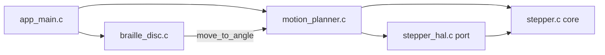

# 1. Architecture layers

The codebase has five layers stacked on top of the physical chip. Each layer
only talks to the one directly below it. Once you can place a file in this
stack, you know what it's allowed to assume and what it's not.

```
┌─────────────────────────────────────────────────────────────────┐
│ App/                     your code: orchestration + own modules │
│   app_main.c/.h            App_init / App_run — the two hooks   │
│   braille_disc.c/.h         UTF-8 byte → character → cell →     │
│                              two disc angles                    │
│   motion_planner.c/.h       owns both motors: driver bring-up,   │
│                              angle→microstep moves, homing       │
│   stepper.h/.c              portable STEP/DIR core (no MCU)      │
│   stepper_hal.h/.c           STM32 port for stepper.h (TIM+GPIO) │
├─────────────────────────────────────────────────────────────────┤
│ Lib/tmc2209/             vendored driver library (3rd-party-ish)│
│   tmc2209.h/.c              portable TMC2209 protocol/register   │
│                              logic (no MCU headers)              │
│   tmc2209_stm32.h/.c         STM32 port for tmc2209.h (CMSIS)    │
├─────────────────────────────────────────────────────────────────┤
│ Middlewares/ + USB_DEVICE/  ST's USB Device Library (vendor) +   │
│                              CubeMX glue + your CDC callbacks    │
├─────────────────────────────────────────────────────────────────┤
│ Core/                    CubeMX-generated boilerplate            │
│   main.c                    entry point, calls App_init/App_run  │
│   gpio.c, usart.c, tim.c    peripheral init via ST HAL calls     │
│   stm32f1xx_it.c            interrupt vector bodies              │
├─────────────────────────────────────────────────────────────────┤
│ Drivers/STM32F1xx_HAL_Driver   ST's HAL: HAL_GPIO_Init,          │
│                                 HAL_TIM_PWM_Start_IT, HAL_Delay… │
├─────────────────────────────────────────────────────────────────┤
│ Drivers/CMSIS            ARM core + ST device headers: struct    │
│                           layouts for GPIOA->BSRR, USART2->SR,   │
│                           TIM2->ARR — i.e. the register map      │
├─────────────────────────────────────────────────────────────────┤
│ Silicon: STM32F103 (Cortex-M3), TMC2209 driver chips             │
└─────────────────────────────────────────────────────────────────┘
```

One caveat about the drawing: the USB stack is stacked in for tidiness, but it
is not something the App layer calls *down* into. It runs on its own interrupt
and hands characters *up* to `App_run()` through a ring buffer — a peer
producer, not a dependency. Everything else in the diagram is a strict
"the layer above calls the layer below" relationship.

## Layer by layer

### CMSIS (`Drivers/CMSIS`) — the register map

Not code you run, mostly `#define`s and `struct` layouts. `GPIO_TypeDef`,
`USART_TypeDef`, `TIM_TypeDef`, `RCC` — these are C structs whose members are
placed at the exact memory offsets the datasheet specifies, so that
`GPIOA->BSRR = ...` compiles into a single store instruction to the real
register. Nothing above this layer works without it; nothing in this layer
knows anything about your application.

### ST HAL (`Drivers/STM32F1xx_HAL_Driver`) — ST's safe, general driver

Functions like `HAL_GPIO_Init`, `HAL_TIM_PWM_Start_IT`, `HAL_RCC_OscConfig`,
`HAL_Delay`. This is ST's own abstraction over CMSIS: it trades a bit of
speed for safety and portability across the whole STM32 family. You never
edit this directory — it's vendored, like a `node_modules`.

**Interesting detail:** parts of this project deliberately *bypass* the HAL
and talk to CMSIS registers directly: `Lib/tmc2209/tmc2209_stm32.c` (UART
polling, GPIO enable pin) and the DIR pin writes in `App/Src/stepper_hal.c`.
See [04-tmc2209-howto.md](04-tmc2209-howto.md) and
[03-stepper-module.md](03-stepper-module.md) for why — in short, `BSRR`
direct writes are faster and glitch-free compared to `HAL_GPIO_WritePin`.
Note the split inside `stepper_hal.c`: the *pin* writes go straight to
`BSRR`, while the *timer* work (`HAL_TIM_PWM_Start_IT`,
`__HAL_TIM_SET_AUTORELOAD`) goes through the HAL, because that path runs once
per move rather than once per pulse.

### Core — CubeMX-generated glue

Everything in `Core/Src` and `Core/Inc` was generated by STM32CubeMX from
`single-cell-braille-controller.ioc` (the pin/peripheral configuration file
you edit in the CubeMX GUI, not by hand). It:

- Turns on peripheral clocks and configures GPIO pin modes
  (`gpio.c: MX_GPIO_Init`) — including the two ZERO sensor inputs, which are
  configured as inputs *with pull-downs* so an unconnected sensor reads low
  instead of floating (see [08-motion-and-homing.md](08-motion-and-homing.md)).
- Configures the two USART peripherals at 115200 8N1
  (`usart.c: MX_USART2_UART_Init`, `MX_USART3_UART_Init`).
- Configures the two STEP timers in PWM mode with their channel and interrupt
  enabled (`tim.c: MX_TIM2_Init`, `MX_TIM3_Init`) — this is what actually
  emits step pulses; the App layer only retunes the period.
- Defines `main()` itself (`main.c`), including the 48 MHz clock tree the USB
  peripheral requires.
- Defines the pin name → `GPIO_TypeDef*`/`GPIO_PIN_x` macros you see used
  everywhere else, e.g. `STEP_MOTOR01_Pin`, `ENABLE_MOTOR02_GPIO_Port`,
  `ZERO_MOTOR01_Pin` (`main.h`).

You *can* hand-edit these files, but only inside `/* USER CODE BEGIN ... */`
`/* USER CODE END ... */` comment pairs — CubeMX preserves those blocks and
overwrites everything else when you regenerate from the `.ioc` file. That's
why `App_init(&huart2, &huart3, &htim2, &htim3);` in `main.c` sits inside a
`USER CODE` block: it's the one line connecting generated boilerplate to your
code.

### Middlewares/ + USB_DEVICE/ — the virtual COM port

`Middlewares/ST/STM32_USB_Device_Library` is ST's unmodified USB device stack;
`USB_DEVICE/` is the CubeMX-generated glue that binds it to this MCU, plus
`usbd_cdc_if.c`, where your own receive ring buffer and `CDC_ReadChar()` live.
This layer sits *beside* the App layer rather than under it: the USB interrupt
is the producer of characters, `App_run()` is the consumer. Full breakdown:
[06-usb-cdc.md](06-usb-cdc.md).

### Lib/tmc2209 — vendored TMC2209 driver

A small library (not written for this project) that speaks the TMC2209's
UART protocol and exposes high-level operations (`tmc2209_set_run_current`,
`tmc2209_enable`, ...). It is itself split in two files that mirror the
overall project layering in miniature:

- `tmc2209.h/.c` — the **core**: register maps, UART datagram framing, CRC,
  and every public `tmc2209_*` function. Contains zero STM32 headers; it
  only touches hardware through a struct of function pointers
  (`tmc2209_hal_t`) passed in by the caller.
- `tmc2209_stm32.h/.c` — the **port**: implements `tmc2209_hal_t` for
  STM32 using raw CMSIS register access. This is the only file in the
  library that knows what a `USART_TypeDef` is.

Full breakdown of what to call and why: [04-tmc2209-howto.md](04-tmc2209-howto.md).

### App — your code

- `app_main.c` — deliberately thin: `App_init()` brings the motors up and
  homes the discs, `App_run()` pulls one byte off the USB ring and hands it to
  the disc translator. Nothing else lives here.
- `braille_disc.c/.h` — the character side: it feeds the incoming byte stream
  through a UTF-8 decoder, looks the resulting character up in a 6-dot pattern
  table, derives a *weight* per disc from that pattern, and converts each
  weight into an absolute angle. Covered in full in
  [07-character-encoding.md](07-character-encoding.md).
- `motion_planner.c/.h` — the motor side and the only file that knows about
  *both* motors at once. It owns the static instances (`tmc_motor_01`,
  `stepper_motor_01`, …), brings up each TMC2209 over UART, binds each stepper
  to its STEP timer and DIR pin, turns absolute angles into shortest-path
  microstep moves, and runs the homing routine that establishes angle 0. It
  also hosts `HAL_TIM_PWM_PulseFinishedCallback()`, because the timer →
  stepper-instance mapping is knowledge that belongs to whoever owns the
  instances. See [08-motion-and-homing.md](08-motion-and-homing.md).
- `stepper.h/.c` + `stepper_hal.h/.c` — a STEP/DIR pulse-generation module
  you wrote, following the exact same core/port split as `Lib/tmc2209`.
  Covered in full in [03-stepper-module.md](03-stepper-module.md).

The dependency direction inside App/ is strictly one way:



`braille_disc.c` includes `motion_planner.h` and nothing below it: it thinks
in characters and angles and has no idea microsteps exist. `motion_planner.c`
is the only App file that includes both `stepper.h` and an STM32 header.

## Why the "core + port" split, twice

Both `Lib/tmc2209` and `App/stepper` separate *portable logic* (no MCU
headers, driven entirely through a HAL struct of function pointers) from a
*platform port* (the only file allowed to mention `GPIO_TypeDef`). The
motivation, recorded when the stepper module was designed: "does this file
belong to the hardware side or the logic side?" — keeping platform types out
of logic code means `stepper.c` and `tmc2209.c` can be compiled and unit
tested on a host machine, with no STM32 toolchain involved, and reused if
the MCU ever changes.

That seam also settles arguments about *where a fact belongs*. The clearest
example in this codebase: both discs are geared so that the direction the
TMC2209 calls "forward" turns them towards *decreasing* braille weight. That
is a property of the wiring and gearing, not of the angle math — so it is
fixed in the port, by the `invert_dir` flag in `stepper_hal.c`, and every
layer above keeps the much simpler invariant "positive steps mean increasing
angle." Fixing it in the planner instead would have meant flipping signs in
`steps_to_angle()`, in the homing directions, and in every future caller.

This is the single idea to hold onto before reading further: **whenever you
see a `*_hal.h`/`*_hal_t` struct of function pointers, it's a seam between
"logic that doesn't care what chip it runs on" and "code that pokes actual
registers."** Once you recognize that seam, both `Lib/tmc2209` and
`App/stepper` stop looking like two unrelated abstractions and start
looking like one repeated, intentional pattern.
