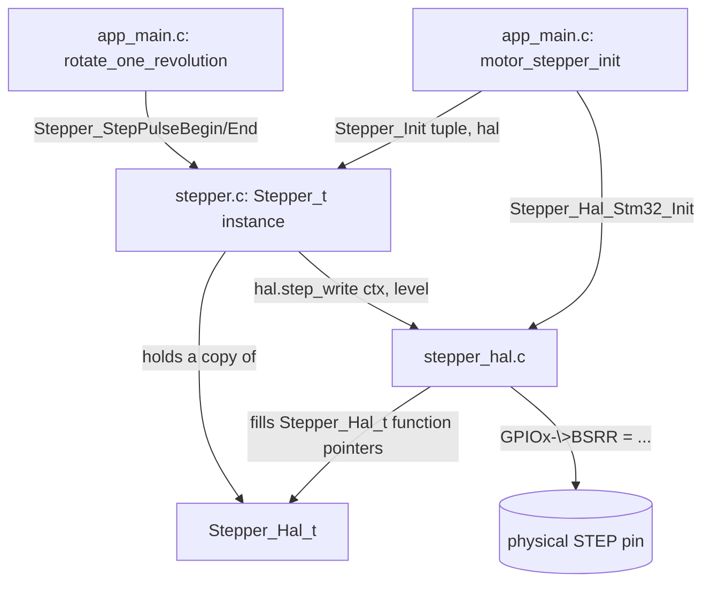

# 3. The stepper module, in full

`App/Inc/stepper.h` + `App/Src/stepper.c` (the **core**) and
`App/Inc/stepper_hal.h` + `App/Src/stepper_hal.c` (the STM32 **port**) are
the one piece of App code you wrote from scratch rather than wiring
together. Together they're barely 100 lines of code, but the split across
four files is exactly the kind of thing that reads as "a lot of ceremony
for toggling two pins" until you can see why each piece exists. This guide
covers all four files completely — there is no hidden part left unexplained.

## 3.1 What problem it solves

A stepper motor moves one increment ("microstep") every time its STEP pin
sees a rising edge, in whatever direction the DIR pin currently indicates.
That's the entire physical interface. The module's job is: given "step
now" and "go this direction," toggle the right pins, and keep a running
count of position so the rest of the app can ask "where is this motor" without
re-deriving it from timing.

## 3.2 `stepper.h` — the public contract

```c
typedef struct Stepper_Hal {
  void (*step_write)(void *ctx, bool level);
  void (*dir_write)(void *ctx, bool level);
  void (*enable_write)(void *ctx, bool enable);  // optional, may be NULL
  void *ctx;
} Stepper_Hal_t;

typedef struct Stepper {
  Stepper_Hal_t hal;
  int32_t position;
  bool forward;
  bool enabled;
} Stepper_t;
```

`Stepper_Hal_t` is three function pointers and a context pointer — that's
the entire "hardware interface" this module needs. It doesn't know what a
GPIO is, what a register is, or what MCU it's running on. `Stepper_t` is
the instance state: current position, current direction, and whether the
driver is (logically) enabled.

Public functions (`App/Inc/stepper.h:47-69`):

| Function | What it does |
|---|---|
| `Stepper_Init(stepper, hal)` | Copies `hal` into the instance, zeroes position, sets direction=forward, drives DIR high / STEP low / (if provided) enable low. |
| `Stepper_Enable` / `Stepper_Disable` | Flip the `enabled` bookkeeping flag; also call `hal.enable_write` if one was provided. |
| `Stepper_IsEnabled` | Read the flag back. |
| `Stepper_SetDirection(stepper, forward)` | Sets `forward` and drives the DIR pin. |
| `Stepper_StepPulseBegin` / `Stepper_StepPulseEnd` | Raise STEP, then lower STEP + update `position`. Split into two calls on purpose — see 3.4. |
| `Stepper_Step` | Convenience: `Begin` immediately followed by `End`, for callers that don't care about pulse width control. |
| `Stepper_GetPosition` / `Stepper_SetPosition` | Read/redefine the step counter (e.g. after homing). |

## 3.3 `stepper.c` — the entire implementation

This is short enough to read in one sitting (`App/Src/stepper.c`, 58 lines).
The only thing worth calling out beyond what the table above already says:

```c
void Stepper_StepPulseEnd(Stepper_t *stepper) {
  stepper->hal.step_write(stepper->hal.ctx, false);
  stepper->position += stepper->forward ? 1 : -1;
}
```

Position bookkeeping happens on the **falling** edge (`End`, not `Begin`),
i.e. only once a pulse is known to have actually completed. This module
never touches a register directly — every one of its four bodies (`Init`,
`Enable`/`Disable`, `SetDirection`, `StepPulseBegin`/`End`) is just calling
through `stepper->hal.*` or reading/writing plain struct fields.

## 3.4 Why `StepPulseBegin`/`StepPulseEnd` are split instead of one `Step()`

A stepper driver needs the STEP pin held high for a minimum pulse width
(100 ns for the TMC2209) before dropping it — and the *caller* is in the
best position to decide how that delay is produced: a tight busy-loop (as
`app_main.c` does today with `step_pulse_width_delay()`), a hardware timer
compare interrupt, or nothing at all if the surrounding code is already
slow enough. If `stepper.c` only exposed one `Stepper_Step()` that did
`high → delay → low` internally, it would have to bake in *some* delay
strategy — and that strategy is a timing/scheduling decision, not a
GPIO-toggling one. `Stepper_Step()` still exists as a convenience wrapper
for callers that don't care, but the split primitives are what let
`app_main.c` insert its own pacing loop (`due` deadline check) between
motors without the module getting in the way.

## 3.5 `stepper_hal.h` — the STM32 port's contract

```c
typedef struct Stepper_Hal_Stm32 {
  GPIO_TypeDef *step_port;   uint16_t step_pin;
  GPIO_TypeDef *dir_port;    uint16_t dir_pin;
  GPIO_TypeDef *enable_port; uint16_t enable_pin;
} Stepper_Hal_Stm32_t;

void Stepper_Hal_Stm32_Init(Stepper_Hal_Stm32_t *port, Stepper_Hal_t *hal,
                             GPIO_TypeDef *step_port, uint16_t step_pin,
                             GPIO_TypeDef *dir_port, uint16_t dir_pin,
                             GPIO_TypeDef *enable_port, uint16_t enable_pin);
```

This is the *only* stepper file allowed to mention `GPIO_TypeDef`. It
holds the actual port/pin pairs and, given those, fills in a `Stepper_Hal_t`
whose three function pointers close over this struct through `void *ctx`.
Passing `NULL` for `enable_port` (which `app_main.c` does for both motors,
since `ENN` is already owned by the `tmc2209_t` instance — see
[02-execution-flow.md](02-execution-flow.md) step 2.3) leaves
`hal->enable_write` as `NULL` too, which is exactly what `Stepper_Init`
checks for before calling it.

## 3.6 `stepper_hal.c` — the actual register writes

```c
static void gpio_write(GPIO_TypeDef *gpio_port, uint16_t pin_mask, bool level) {
  if (level) {
    gpio_port->BSRR = pin_mask;
  } else {
    gpio_port->BSRR = (uint32_t)pin_mask << 16u;
  }
}
```

`BSRR` ("bit set/reset register") is a write-only register where writing a
1 into bit *n* atomically sets pin *n*, and writing a 1 into bit *n+16*
atomically clears it — one instruction, no read-modify-write, no race with
an interrupt touching a different pin on the same port. This is why the
module bypasses `HAL_GPIO_WritePin` (which is a small function call that
internally does the same thing, plus parameter checks) — at microstep
rates in the hundreds-of-Hz to kHz range, direct `BSRR` writes are cheap
and jitter-free enough to matter, matching the same choice made in
`Lib/tmc2209/tmc2209_stm32.c` for its enable pin. `enable_write` inverts
the level because the TMC2209's `ENN` input is active-low — that inversion
is documented right there in the comment above the function, so it isn't a
surprise buried in caller code.

## 3.7 Everything in one call graph



Nothing here does dynamic allocation, virtual dispatch tables, or anything
beyond one struct copy and a couple of function-pointer indirections
resolved at init time. If this still feels like a lot for "toggle a pin,"
[05-is-it-overengineered.md](05-is-it-overengineered.md) addresses that
directly — including the parts of this project where the answer is closer
to "yes, a little."
