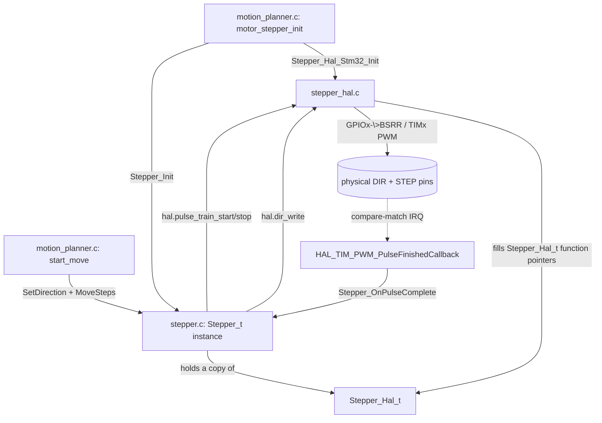

# 3. The stepper module, in full

`App/Inc/stepper.h` + `App/Src/stepper.c` (the **core**) and
`App/Inc/stepper_hal.h` + `App/Src/stepper_hal.c` (the STM32 **port**) are
the one piece of App code you wrote from scratch rather than wiring
together. Together they're barely 200 lines of code, but the split across
four files is exactly the kind of thing that reads as "a lot of ceremony
for toggling two pins" until you can see why each piece exists. This guide
covers all four files completely — there is no hidden part left unexplained.

## 3.1 What problem it solves

A stepper motor moves one increment ("microstep") every time its STEP pin
sees a rising edge, in whatever direction the DIR pin currently indicates.
That's the entire physical interface. But "toggle STEP N times, evenly spaced"
is not something you want the CPU doing in a loop: the spacing *is* the motor
speed, and a superloop that also has to service USB cannot keep it even.

So the module's job is narrower and more interesting than pin toggling:
**own a step budget and a position, and let the hardware produce the pulses.**
The caller says "600 microsteps forward at 1600 Hz"; the module asks the port
to start a pulse train, counts the pulses as they complete, stops the train on
the last one, and keeps a running position so the rest of the app can ask
"where is this disc" without re-deriving it from timing.

## 3.2 `stepper.h` — the public contract

```c
typedef struct Stepper_Hal {
  void (*dir_write)(void *ctx, bool level);
  void (*enable_write)(void *ctx, bool enable);          // optional, may be NULL
  void (*pulse_train_start)(void *ctx, uint32_t pulse_hz);
  void (*pulse_train_stop)(void *ctx);
  void *ctx;
} Stepper_Hal_t;

typedef struct Stepper {
  Stepper_Hal_t hal;
  int32_t position;             // signed step count
  volatile uint32_t remaining;  // steps left in this move, 0 when idle
  bool forward;
  bool enabled;
} Stepper_t;
```

`Stepper_Hal_t` is four function pointers and a context pointer — that's the
entire "hardware interface" this module needs. It doesn't know what a GPIO is,
what a timer is, or what MCU it's running on. The contract on
`pulse_train_start` is the load-bearing part: *the port must raise exactly one
`Stepper_OnPulseComplete()` call per emitted pulse.* Everything else follows
from that.

`remaining` is `volatile` because it is written in interrupt context
(`Stepper_OnPulseComplete`) and read from the main loop (`Stepper_IsBusy`).
Without it, `while (Stepper_IsBusy(s)) {}` is free to become an infinite loop
at `-O2` — the compiler has no reason to believe the value can change.

Public functions:

| Function | What it does |
|---|---|
| `Stepper_Init(stepper, hal)` | Copies `hal` into the instance, zeroes position and step budget, sets direction=forward, stops the pulse train, and (if provided) drives the enable output to "disabled". |
| `Stepper_Enable` / `Stepper_Disable` | Flip the `enabled` bookkeeping flag; also call `hal.enable_write` if one was provided. |
| `Stepper_IsEnabled` | Read the flag back. |
| `Stepper_SetDirection(stepper, forward)` | Sets `forward` and drives the DIR pin. Takes effect on the next move; the position count follows this flag. |
| `Stepper_MoveSteps(stepper, steps, pulse_hz)` | Starts a background move of `steps` pulses at `pulse_hz` and returns immediately. |
| `Stepper_Stop` | Abort the current move; the position keeps whatever was already stepped. |
| `Stepper_IsBusy` | True while a move is running — this is what callers poll. |
| `Stepper_OnPulseComplete` | Called *by the port*, once per emitted pulse, normally from an ISR. |
| `Stepper_GetPosition` / `Stepper_SetPosition` | Read/redefine the step counter. `SetPosition` is how homing declares "this point is angle 0". |

## 3.3 `stepper.c` — the entire implementation

Short enough to read in one sitting (`App/Src/stepper.c`, 73 lines). Only
three bodies do anything beyond forwarding to the HAL, and each of them is
guarding against a specific way concurrency can bite:

```c
void Stepper_MoveSteps(Stepper_t *stepper, uint32_t steps, uint32_t pulse_hz) {
  if (steps == 0u || pulse_hz == 0u || stepper->remaining != 0u) {
    return;
  }
  // Written before the train starts, so no interrupt can be in flight here.
  stepper->remaining = steps;
  stepper->hal.pulse_train_start(stepper->hal.ctx, pulse_hz);
}
```

The `remaining != 0u` test makes a new move a no-op while one is still
running, instead of quietly corrupting the budget of the move in progress
(`Stepper_Stop()` first if you mean to override). And the ordering matters:
`remaining` is set *before* the train is allowed to start, so the first
completed pulse can never find a zero budget.

```c
void Stepper_OnPulseComplete(Stepper_t *stepper) {
  // A pulse already in flight when the train was stopped still raises this
  // callback; it must not be counted against the next move.
  if (stepper->remaining == 0u) {
    return;
  }
  stepper->position += stepper->forward ? 1 : -1;
  if (--stepper->remaining == 0u) {
    stepper->hal.pulse_train_stop(stepper->hal.ctx);
  }
}
```

Two things happen here and nowhere else: the **position advances** (only on a
pulse that actually completed, and in whichever direction the flag says), and
the **train stops itself** on the last step. The idle guard at the top is not
theoretical — `Stepper_Stop()` can zero the budget while a pulse is already
mid-flight in the timer, and that late callback must not be charged to the
next move.

`Stepper_IsBusy()` is then just `remaining != 0u`, which is what makes the
planner's `while (Stepper_IsBusy(...)) {}` spins correct: the exit condition
is published by the same ISR that finished the move.

## 3.4 Why a hardware pulse train instead of a stepping loop

An earlier version of this module exposed `Stepper_StepPulseBegin()` /
`Stepper_StepPulseEnd()` and let the caller pace the pulses in a loop. The
current interface — "start a train at this rate, tell me when the budget is
spent" — is better for three concrete reasons:

- **Timing accuracy.** Pulse spacing is generated by timer hardware, so it is
  exact and jitter-free regardless of what the CPU is doing. A software-paced
  loop competes with the USB interrupt for cycles, and every stolen
  microsecond shows up as speed ripple in the motor.
- **The CPU is free during a move.** A move is "set two registers, enable an
  interrupt." The main loop could do other work while the discs turn; today it
  chooses to block in `wait_until_idle()`, but that's the planner's policy, not
  a constraint the module imposes.
- **Pulse width stops being the caller's problem.** The TMC2209 needs a
  minimum STEP high time (100 ns); a 50% duty PWM at any rate this project
  uses satisfies it by construction, so no caller ever has to produce a delay.

What the caller still owns is the *rate*, because rate is a motion decision
(see `APP_STEP_RATE_HZ` and the homing rates in
[08-motion-and-homing.md](08-motion-and-homing.md)), not a pin-toggling one.

## 3.5 `stepper_hal.h` — the STM32 port's contract

```c
typedef struct Stepper_Hal_Stm32 {
  TIM_HandleTypeDef *step_tim;   // timer whose PWM output drives STEP
  uint32_t step_channel;         // TIM_CHANNEL_x routed to the STEP pin
  GPIO_TypeDef *dir_port;   uint16_t dir_pin;
  bool invert_dir;               // drive DIR inverted (mirrored motor)
  GPIO_TypeDef *enable_port; uint16_t enable_pin;
} Stepper_Hal_Stm32_t;

void Stepper_Hal_Stm32_Init(Stepper_Hal_Stm32_t *port, Stepper_Hal_t *hal,
                            TIM_HandleTypeDef *step_tim, uint32_t step_channel,
                            GPIO_TypeDef *dir_port, uint16_t dir_pin,
                            bool invert_dir, GPIO_TypeDef *enable_port,
                            uint16_t enable_pin);
```

This is the *only* stepper file allowed to mention `GPIO_TypeDef` or
`TIM_HandleTypeDef`. Four things about this signature are worth calling out:

- **The STEP pin is not passed.** `MX_TIMx_Init()` already put PA1/PB1 into
  alternate-function mode via `HAL_TIM_MspPostInit()`; from then on the pin
  belongs to the timer, not to this port. What the port needs is the timer
  handle and the channel.
- **One timer per motor, not one channel per motor.** The pulse-counting
  interrupt is per timer, so two motors sharing TIM2 on different channels
  would both be counted by whichever instance the callback picked. Motor 1 is
  TIM2_CH2, motor 2 is TIM3_CH4.
- **`invert_dir` is where a mirrored motor is corrected.** Both discs on this
  board are geared so that the direction the driver calls "forward" turns them
  towards *decreasing* braille weight, so both are initialized with
  `invert_dir = true` (`APP_MOTOR_DIR_INVERTED` in `motion_planner.c`). Which
  way DIR turns the load is a wiring/gearing fact, so it is fixed at the pin;
  every layer above keeps the invariant "positive steps = increasing angle."
  Rebuild a motor the other way round and you flip one `#define`, not the
  angle math.
- **`enable_port = NULL` is the normal case here.** Both motors pass `NULL`,
  because the `ENN` line is owned by that motor's `tmc2209_t` instance instead
  (see [02-execution-flow.md](02-execution-flow.md) §2.3.1). That leaves
  `hal->enable_write` as `NULL` too, which is exactly what `Stepper_Init` and
  `Stepper_Enable` check for before calling it.

## 3.6 `stepper_hal.c` — the actual register writes

### Pins: `BSRR`, directly

```c
static void gpio_write(GPIO_TypeDef *gpio_port, uint16_t pin_mask, bool level) {
  if (level) {
    gpio_port->BSRR = pin_mask;
  } else {
    gpio_port->BSRR = (uint32_t)pin_mask << 16u;
  }
}

static void dir_write(void *ctx, bool level) {
  Stepper_Hal_Stm32_t *port = ctx;
  gpio_write(port->dir_port, port->dir_pin, port->invert_dir ? !level : level);
}
```

`BSRR` ("bit set/reset register") is a write-only register where writing a
1 into bit *n* atomically sets pin *n*, and writing a 1 into bit *n+16*
atomically clears it — one instruction, no read-modify-write, no race with
an interrupt touching a different pin on the same port. This is why the
module bypasses `HAL_GPIO_WritePin`, matching the same choice made in
`Lib/tmc2209/tmc2209_stm32.c` for its enable pin. `enable_write` inverts the
level because the TMC2209's `ENN` input is active-low — that inversion is
documented right there in the comment above the function, so it isn't a
surprise buried in caller code.

### Rate: deriving the timer tick

```c
static uint32_t timer_tick_hz(TIM_HandleTypeDef const *tim) {
  uint32_t tick_hz = HAL_RCC_GetPCLK1Freq();
  if ((RCC->CFGR & RCC_CFGR_PPRE1) != RCC_CFGR_PPRE1_DIV1) {
    tick_hz *= APB1_TIMER_CLOCK_MULTIPLIER;   // 2
  }
  return tick_hz / (tim->Instance->PSC + 1u);
}
```

Both STEP timers sit on APB1, whose *timer* clock is PCLK1 doubled whenever
the APB1 prescaler isn't 1 (RM0008 clock tree) — a genuinely easy detail to
get wrong by a factor of two. With today's tree that resolves to
24 MHz × 2 / (47 + 1) = **1 MHz**. Deriving it instead of hardcoding it means
retuning the clock in CubeMX doesn't silently halve every step rate.

### The clamp that prevents a hang

```c
uint32_t ticks = timer_tick_hz(port->step_tim) / pulse_hz;
if (ticks > STEP_TIMER_MAX_PERIOD_TICKS) {          // 1 << 16
  ticks = STEP_TIMER_MAX_PERIOD_TICKS;
} else if (ticks < STEP_TIMER_MIN_PERIOD_TICKS) {   // 2
  ticks = STEP_TIMER_MIN_PERIOD_TICKS;
}
```

TIM2 and TIM3 are 16-bit: `ARR` and `CCR` hold 0..65535. Ask for a rate
slower than one pulse per full counter range (below ≈15 Hz at a 1 MHz tick)
and the unclamped period wraps `ARR` and `CCR` independently — `CCR` can land
*above* `ARR`, which never produces a compare match. STEP would stay high, no
pulse callback would ever fire, and every caller waiting on
`Stepper_IsBusy()` would spin forever. The clamp turns an unreachable rate
into a move that is merely slower than asked for. The lower clamp is the
mirror case: it caps the rate at half the tick rate rather than dividing by
zero.

This is why `APP_HOMING_FINE_RATE_HZ` is 25 Hz and not, say, 5 Hz: the fine
approach wants to be slow, but it has to stay clear of the hardware floor.

### Starting the train

```c
__HAL_TIM_SET_AUTORELOAD(port->step_tim, ticks - 1u);
__HAL_TIM_SET_COMPARE(port->step_tim, port->step_channel,
                      ticks / STEP_PULSE_DUTY_DIVISOR);
HAL_TIM_GenerateEvent(port->step_tim, TIM_EVENTSOURCE_UPDATE);
port->step_tim->Instance->SR = 0u;
HAL_TIM_PWM_Start_IT(port->step_tim, port->step_channel);
```

Each line earns its place:

- `ARR`/`CCR` are both **preloaded** (`AutoReloadPreload` in `MX_TIMx_Init`,
  `OCxPE` set by `HAL_TIM_PWM_ConfigChannel`), so the values written above sit
  in shadow registers until an update event. Forcing one now means the *first*
  pulse already uses the new period instead of the previous move's; it also
  resets the counter, so the train starts with a full pulse.
- That forced update raises flags. Clearing `SR` prevents a **phantom pulse
  callback** the instant the interrupt is enabled — which would otherwise
  charge a pulse that never physically happened to the new move's budget.
- `HAL_TIM_PWM_Start_IT` in PWM mode 1 drives STEP high immediately (counter
  at 0) and ends the pulse at the compare match, which is the interrupt that
  counts it: one callback per completed pulse, exactly as the core requires.

`pulse_train_stop()` is the counterpart: disabling the channel hands the pin
back to the GPIO output register, which is 0 out of reset, so STEP idles low
as the TMC2209 expects.

## 3.7 Everything in one call graph



Note the loop at the bottom: the port drives the hardware, and the hardware
drives the core back through an interrupt. That cycle is the module — the
"abstraction" is one struct copy and a couple of function-pointer
indirections resolved at init time, with no dynamic allocation and no dispatch
tables anywhere.

## 3.8 The payoff: it compiles on your laptop

Because `stepper.c` includes nothing but `stepper.h` and `stddef.h`, the whole
budget/position/direction state machine can be built and exercised on a host
with a plain C compiler and a fake HAL — a `pulse_train_start` that just
records the rate and calls `Stepper_OnPulseComplete()` the requested number of
times is enough to test move accounting, the idle guard, and the homing logic
above it, with no board attached. That is the concrete return on the core/port
split, and it's the reason [05-is-it-overengineered.md](05-is-it-overengineered.md)
answers "no" for this module in particular.
