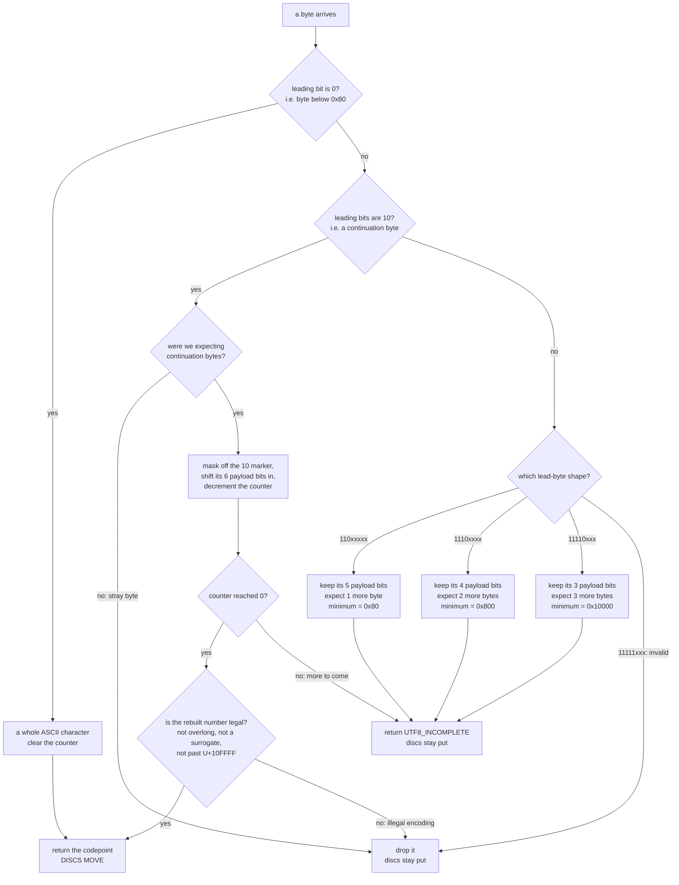

# 07 — Character encoding: from a keypress to a disc angle

This guide explains the UTF-8 decoder in `App/Src/braille_disc.c` — the piece
that sits between "a byte arrived over USB" and "look this character up in the
braille table."

It exists because **a byte is not a character**. The host sends UTF-8, in which
`á`, `ç` and `é` each occupy two bytes, while the braille table is indexed by
single-byte character codes. Something has to reassemble one from the other,
and doing it wrong has a very visible failure mode on this hardware: a decoder
that renders every byte on its own makes each accented key drive both discs out
and immediately snap them back. That symptom is used throughout this guide as a
worked example, because it makes the difference between a byte and a character
physical.

Every hex number in the code is explained here in terms of *what it means about
a character*, not as a magic constant. If you only remember one thing:

> Hex numbers in this decoder are never "the letter X". They are
> **markers** (bit patterns that say "I am the first byte" / "I am a leftover
> byte"), **masks** (which say "ignore the marker bits, keep the payload"), or
> **thresholds** (codepoint values that mark the edge of a legal range).

---

## 1. Three different things that all get called "a character"

Keeping these three apart is the whole job. Conflating them is what produces
the double-move symptom:

| Thing | Example for `ç` | Who owns it |
|---|---|---|
| **The key you press** | the `ç` key | you, at the keyboard |
| **The codepoint** — the character's official ID number in Unicode | `U+00E7`, which is just decimal **231** | the Unicode standard |
| **The bytes on the wire** — how that ID gets packed for transmission | `0xC3` then `0xA7` — **two** bytes | the *encoding* (UTF-8) |

A codepoint is a number. A byte stream is how you ship that number. **An
encoding is the packing rule that converts between them.** UTF-8 is one such
rule; Latin-1 (ISO-8859-1) is another.

The critical asymmetry:

- **ASCII letters** (`a`–`z`, `A`–`Z`): codepoint fits in one byte, and UTF-8
  ships it as exactly one byte. One keypress → one byte.
- **Accented letters**: codepoint `231` still fits in one byte numerically, but
  **UTF-8 refuses to ship any codepoint ≥ 128 as a single byte** (section 4
  explains why). One keypress → *two* bytes.

That asymmetry — one keypress, two bytes — is why the decoder cannot be a
pass-through. A renderer driven per byte renders two cells for one letter.

---

## 2. What the braille table is actually indexed by

Look at the table in [`braille_disc.c:42`](../App/Src/braille_disc.c#L42):

```c
static const uint8_t braille_pattern[256] = {
    ['A'] = DOT1,
    ...
    [0xC7] = DOT1 | DOT2 | DOT3 | DOT4 | DOT6,        // C-cedilla
```

256 slots, so the index must be a number in 0–255. The encoding it assumes is
**Latin-1**, whose defining property is beautifully simple:

> In Latin-1, the byte value **is** the codepoint, for codepoints U+0000
> through U+00FF.

So `0xC7` = 199 = `U+00C7` = `Ç`. The row `[0xC7]` genuinely is "the Ç row".
Here, `0xC7` really does mean a letter. This is the **only** place in the flow
where a hex number names a character — and it is what lets the decoder hand its
result straight to the table with no translation layer in between.

`pattern_for_char()` at [`braille_disc.c:95`](../App/Src/braille_disc.c#L95)
takes such a number and folds lowercase to uppercase before the lookup.

**So the decoder's one job is:** turn a stream of UTF-8 bytes back into these
0–255 character codes.

---

## 3. Why the bytes can't go straight to the table

Suppose `App_run()` popped one byte from the USB ring buffer and passed it
straight to the table as if it were a Latin-1 code. You press `ç` once, two
bytes arrive, and the firmware renders **two characters**:

**Byte 1 — `0xC3`.** Interpreted as Latin-1, 0xC3 = 195 = `U+00C3` = **`Ã`**.
That row *exists* in the table (A-tilde is a Portuguese letter!). So the discs
drive to Ã's cell: disc 1 → 45.0°, disc 2 → 135.0°.

**Byte 2 — `0xA7`.** Interpreted as Latin-1, 0xA7 = `§`, the section sign. Not
a braille letter, so its row is `0` — a **blank cell**. The discs drive back to
0.0°/0.0°.

Move out, move back — for a single keypress.

Two details make this a *systematic* failure rather than bad luck, and they are
the reason a decoder is mandatory rather than a nicety:

**(a) Every Portuguese accented letter has the same first byte, `0xC3`.**
So they would all behave identically:

| you press | codepoint | bytes sent | byte 1 read as Latin-1 | byte 2 read as Latin-1 |
|---|---|---|---|---|
| `á` | U+00E1 | `C3 A1` | `Ã` → moves | `¡` → blank |
| `ã` | U+00E3 | `C3 A3` | `Ã` → moves | `£` → blank |
| `ç` | U+00E7 | `C3 A7` | `Ã` → moves | `§` → blank |
| `é` | U+00E9 | `C3 A9` | `Ã` → moves | `©` → blank |
| `ô` | U+00F4 | `C3 B4` | `Ã` → moves | `´` → blank |
| `ú` | U+00FA | `C3 BA` | `Ã` → moves | `º` → blank |
| `Ç` | U+00C7 | `C3 87` | `Ã` → moves | (unassigned) → blank |

Section 4 shows *why* `0xC3` is shared by all of them — it's arithmetic, not
coincidence.

**(b) The second byte can never accidentally work.** UTF-8 continuation bytes
are always in the range `0x80`–`0xBF`, and the table populates only `A`–`Z`
plus `0xC0`–`0xDC`. The two ranges never overlap, so the second byte is
*guaranteed* to render blank. There are no lucky cases to fall back on.

The only way out is to rebuild the codepoint before touching the table. That is
what `utf8_decode_byte()` does.

---

## 4. How UTF-8 packs a codepoint into bytes

UTF-8's design goal: stay byte-compatible with ASCII, but still be able to ship
any of Unicode's ~1.1 million codepoints. Its trick is to spend the top bits of
each byte on **markers** and the remaining bits on **payload**.

Here are the four byte shapes. Read `x` as "payload bit — part of the actual
codepoint" and the leading `0`/`1`s as the marker:

```
1 byte :  0xxxxxxx                                7 payload bits
2 bytes:  110xxxxx  10xxxxxx                     11 payload bits
3 bytes:  1110xxxx  10xxxxxx  10xxxxxx           16 payload bits
4 bytes:  11110xxx  10xxxxxx  10xxxxxx  10xxxxxx 21 payload bits
```

Three rules fall straight out of that picture, and they are the whole spec you
need:

1. **A byte with a leading `0` is a complete ASCII character.** Values 0–127.
   This is why UTF-8 is a superset of ASCII.
2. **A byte starting `110`, `1110`, or `11110` is a *lead byte*.** The count of
   `1`s before the first `0` tells you the total length of the sequence: `110` →
   2 bytes, `1110` → 3 bytes, `11110` → 4 bytes.
3. **A byte starting `10` is a *continuation byte*** — a middle-or-end piece,
   meaningless on its own. This is the self-synchronising property: you can
   always tell a lead byte from a continuation byte, so a decoder can never get
   permanently lost.

Note the consequence: **every codepoint ≥ 128 needs a lead byte**, and lead
bytes all start with `11`, i.e. `0xC0` or higher. So `ç` cannot be shipped as
one byte even though 231 fits in eight bits. Byte 231 (`1110 0111`) starts with
`1110`, which UTF-8 has already reserved to mean "a 3-byte sequence starts
here." The meaning is taken.

### Packing `ç` by hand

`ç` = U+00E7 = 231. It needs 2 bytes, which carry 11 payload bits, so write 231
as 11 bits:

```
231 in 11 bits:    00011 100111
                   └─┬─┘ └──┬─┘
        top 5 bits = 3      low 6 bits = 39
```

Drop those two groups into the `110xxxxx 10xxxxxx` template:

```
lead byte:  110 00011  = 1100 0011 = 0xC3
cont byte:  10  100111 = 1010 0111 = 0xA7
```

There it is — `C3 A7`, the bytes your terminal actually sends.

### Why *all* accented letters share `0xC3`

Look at what the lead byte carries: only the **top 5 of the 11 payload bits**.
For any codepoint in U+00C0–U+00FF (which is exactly where the Portuguese
accented letters live), those top 5 bits are always the same:

```
U+00C0 = 000 1100 0000  -> top 5 = 00011 = 3  -> lead 110 00011 = 0xC3
U+00E7 = 000 1110 0111  -> top 5 = 00011 = 3  -> lead 110 00011 = 0xC3
U+00FF = 000 1111 1111  -> top 5 = 00011 = 3  -> lead 110 00011 = 0xC3
```

The letters differ only in their *low 6 bits*, which live in the **second**
byte. So the first byte is identical for the whole block, and all of the
identity sits in the byte that a per-byte renderer would discard as `§`, `¡` or
`£`. Hence one shared symptom for 26 different letters.

(Codepoints U+0080–U+00BF have top-5 bits `00010` = 2, giving lead byte `0xC2`.
That's the other lead byte you'll see in the wild for Latin-1-range text.)

---

## 5. Reading the decoder, constant by constant

Now the code at [`braille_disc.c:155`](../App/Src/braille_disc.c#L155). Every
constant in this section is a **marker test** or a **payload mask**, never a
letter. (The third kind — thresholds, which *are* codepoint values — belongs to
the legality check and is covered in section 7.)

### The two masking idioms

**A "which shape is this byte?" test** looks like `(byte & MASK) == MARKER`.
The mask blanks out the payload so you can compare only the marker bits:

| Test in code | Mask in binary | Reads as | Meaning |
|---|---|---|---|
| `byte < 0x80` | — | is bit 7 clear? | leading `0` → **a complete ASCII character** |
| `(byte & 0xC0u) == 0x80u` | `1100 0000` vs `1000 0000` | look at top **2** bits; are they `10`? | **a continuation byte** — a leftover piece |
| `(byte & 0xE0u) == 0xC0u` | `1110 0000` vs `1100 0000` | look at top **3** bits; are they `110`? | **lead byte of a 2-byte sequence** |
| `(byte & 0xF0u) == 0xE0u` | `1111 0000` vs `1110 0000` | look at top **4** bits; are they `1110`? | **lead byte of a 3-byte sequence** |
| `(byte & 0xF8u) == 0xF0u` | `1111 1000` vs `1111 0000` | look at top **5** bits; are they `11110`? | **lead byte of a 4-byte sequence** |

Notice the mask grows by one bit each row (`0xC0` → `0xE0` → `0xF0` → `0xF8`)
because each shape has one more marker bit than the last.

These five tests are **mutually exclusive and exhaustive**: the markers form a
prefix code, so any byte in 0–255 satisfies exactly one of them (or none, which
is the invalid `11111xxx` case). That's a design property of UTF-8, not luck —
it's why the decoder is a plain `if`/`else if` chain with no ambiguity to
resolve, and why a byte can always be classified on sight.

**A "keep only the payload" mask** is `byte & MASK`, where the mask has a `1`
exactly where the payload bits are — the complement of the marker:

| Mask | Binary | Strips off | Keeps |
|---|---|---|---|
| `0x1Fu` | `0001 1111` | the `110` marker | **5** payload bits from a 2-byte lead |
| `0x0Fu` | `0000 1111` | the `1110` marker | **4** payload bits from a 3-byte lead |
| `0x07u` | `0000 0111` | the `11110` marker | **3** payload bits from a 4-byte lead |
| `0x3Fu` | `0011 1111` | the `10` marker | **6** payload bits from any continuation byte |

So `byte & 0x1Fu` does **not** mean "letter 0x1F". It means: *this is the first
byte of a two-byte letter — throw away the "I am a lead byte" flag and give me
the 5 bits of the letter's ID that it's carrying.*

### The three state variables

```c
static uint32_t utf8_codepoint;      // ID number rebuilt so far
static uint32_t utf8_min_codepoint;  // smallest ID this length may legally hold
static uint8_t utf8_bytes_remaining; // how many more bytes this letter needs
```

They're `static` because the decoder must **remember across calls** — a letter's
bytes arrive on separate trips through the main loop. `utf8_bytes_remaining == 0`
means "not currently in the middle of a letter."

`utf8_min_codepoint` is the validity guard: the lead byte fixes how long the
sequence is, and the length in turn fixes the smallest codepoint it is *allowed*
to carry. Section 7 explains why that matters.

### The `<< 6` shift

```c
utf8_codepoint = (utf8_codepoint << 6) | (byte & 0x3Fu);
```

Each continuation byte contributes exactly 6 payload bits. So: shift what you
have 6 places left to make room, then OR the new 6 bits into the hole. It's the
same move as building a decimal number digit by digit (`n = n * 10 + digit`),
except the base is 64 instead of 10.

For `ç`:

```
lead byte 0xC3, keep its 5 payload bits:            00011    (=   3)
shift left 6 to make room:                    00011 000000   (= 192)
OR in the 6 payload bits of 0xA7 (= 100111):  00011 100111   (= 231)
                                              └──────┬────┘
                            231 = 0xE7 = U+00E7 = the ç row in the table
```

Compare that with the packing diagram in section 4 and you'll see they are
mirror images of each other: packing splits 11 bits into 5 + 6 and adds markers;
unpacking strips the markers and glues 5 + 6 back together.

### The `UTF8_INCOMPLETE` sentinel

```c
#define UTF8_INCOMPLETE 0xFFFFFFFFu
```

The function must be able to say "nothing to report." `0xFFFFFFFF` is not a
letter and not a code — it's just a value that can never be a valid codepoint
(Unicode stops at U+10FFFF), so it's safe to reserve for that meaning.

It covers **two** situations, and the caller treats them identically:

- *"no character yet, come back with more bytes"* — a lead byte, or a
  continuation byte that isn't the last one;
- *"that sequence was never a character"* — a stray or malformed byte, or a
  complete sequence that failed the validity check in section 7.

`translate_char_on_disc()` checks for the sentinel and **returns without moving
the discs** ([`braille_disc.c:266`](../App/Src/braille_disc.c#L266)). That early
return is what makes one keypress produce at most one movement: every byte that
isn't the last byte of a valid character leaves the discs exactly where they
are.

---

## 6. Full traces

### `a` — plain ASCII, one byte

| byte | leading bits | branch | result |
|---|---|---|---|
| `0x61` | `0` | ASCII | returns 97 → table row `'a'` → **one move** |

### `ç` — two bytes, one move

| byte | leading bits | branch | state after | returns |
|---|---|---|---|---|
| `0xC3` | `110` | 2-byte lead | codepoint=3, remaining=1 | `UTF8_INCOMPLETE` → **discs don't move** |
| `0xA7` | `10` | continuation | codepoint=231, remaining=0 | **231** → table row `0xE7` = ç → **one move** |

The first byte contributes state, not motion. That is the difference between
this and the per-byte reading in section 3, which turned the same two bytes into
two moves.

### `—` (em dash, U+2014) — three bytes, renders blank

| byte | leading bits | branch | state after | returns |
|---|---|---|---|---|
| `0xE2` | `1110` | 3-byte lead | codepoint=2, remaining=2 | `UTF8_INCOMPLETE` |
| `0x80` | `10` | continuation | codepoint=128, remaining=1 | `UTF8_INCOMPLETE` |
| `0x94` | `10` | continuation | codepoint=8212, remaining=0 | **8212** (= 0x2014) |

8212 is above 255, so it can't index a 256-entry table. The guard in
`translate_char_on_disc()` substitutes `0`, the blank cell:

```c
uint8_t character = (codepoint <= 0xFFu) ? (uint8_t)codepoint : 0u;
```

The alternative — truncating 8212 to a byte — would give `0x14`, silently
aliasing an em dash onto a random control code. Rendering blank is honest: *this
disc pair has no cell for that character.*

### `C1 81` — two bytes that decode to `A`, and are rejected anyway

| byte | leading bits | branch | state after | returns |
|---|---|---|---|---|
| `0xC1` | `110` | 2-byte lead | codepoint=1, remaining=1, **min=0x80** | `UTF8_INCOMPLETE` |
| `0x81` | `10` | continuation | codepoint=65, remaining=0 | 65 < min → `UTF8_INCOMPLETE` → **discs don't move** |

The bits rebuild cleanly into 65 — capital `A` — but a 2-byte sequence is not
allowed to carry a codepoint that small. Section 7 explains why the decoder
throws it away instead of rendering an `A`.

---

## 7. Not every sequence that decodes is a legal one

Sections 4–6 covered the *shape* of a sequence: does the marker say 2 bytes, and
did 2 bytes arrive? Passing that test is necessary but **not sufficient**. Three
families of sequence have perfectly well-formed markers and rebuild into a clean
number, yet are still invalid UTF-8. The decoder checks for all three at the
moment the last continuation byte lands
([`braille_disc.c:169`](../App/Src/braille_disc.c#L169)).

### (a) Overlong forms — the same letter spelled the long way

Look again at the packing table in section 4. A 2-byte sequence carries 11
payload bits, but `A` (codepoint 65) only needs 7 of them. Nothing in the *bit
layout* stops you from padding it out:

```
                                              payload bits        value
'A' the correct way:   0x41              ->        100 0001   =  65
'A' the overlong way:  0xC1 0x81         ->  00001 000001     =  65
'A' the longer way:    0xE0 0x81 0x81    ->   0000 000001 000001  =  65
                                              └── leading zeros are pure padding
```

All three rebuild to 65. That's the problem: **UTF-8 requires every codepoint to
have exactly one spelling** — always the shortest one that fits. Alternate
spellings are aliases, and aliases are how encoding bugs turn into security
holes elsewhere (a filter that rejects the literal byte `/` doesn't recognise
`0xC0 0xAF`).

The rule that kills them is simple arithmetic on the payload width:

| Sequence length | Payload bits | Smallest codepoint it may carry |
|---|---|---|
| 1 byte | 7 | `0x0` |
| 2 bytes | 11 | `0x80` |
| 3 bytes | 16 | `0x800` |
| 4 bytes | 21 | `0x10000` |

Each row's minimum is just the row above's maximum plus one — the point where
the shorter form runs out of bits and you genuinely *need* the longer one. So
the lead byte, which already tells the decoder the length, also tells it the
minimum; the code records it in `utf8_min_codepoint` and compares once at the
end.

That single stored threshold is why the check costs nothing structurally: the
decoder never has to look back at the bytes it consumed, only at one number it
wrote down when the sequence started.

### (b) Surrogate halves, U+D800–U+DFFF

These 2048 codepoints are not characters at all. They're a UTF-**16** implementation
detail — reserved so that UTF-16 can express codepoints above U+FFFF as a pair.
Unicode permanently excludes them from every other encoding, so a 3-byte
sequence landing in that range (e.g. `ED A0 80`) is invalid however tidy its
markers look.

### (c) Anything past U+10FFFF

Unicode's ceiling is U+10FFFF — chosen because that's the largest value UTF-16's
surrogate-pair trick can address. A 4-byte sequence carries 21 payload bits and
can therefore express up to U+1FFFFF, so **the encoding is physically capable of
numbers Unicode does not define**. `F4 90 80 80` decodes to U+110000, one past
the end. Rejected.

### What this costs, and what it buys

Two comparisons and a subtraction per completed multi-byte character, plus 4
bytes of RAM for `utf8_min_codepoint`. In exchange, a byte pair cannot alias
onto a letter that has its own honest spelling.

That matters concretely on this hardware, not just in theory. Without the check,
feeding `C1 81` would move the discs to `A`: a host with a buggy encoder — or
anyone poking at the serial port by hand — could drive the cell to a letter
without ever sending that letter's real bytes. With it, the sequence is dropped
and the discs hold position.

Note the deliberate asymmetry with section 6's em dash:

| Input | Verdict | Behaviour |
|---|---|---|
| `E2 80 94` (em dash, U+2014) | valid encoding, no braille cell | renders **blank** |
| `C1 81` (overlong `A`) | invalid encoding | renders **nothing at all** |

A real character this display can't show still gets an honest answer — an empty
cell. A sequence that was never a character gets no answer, because there was no
question.

---

## 8. Why malformed input can't wedge the decoder

Four defences, all visible in the code:

1. **A stray continuation byte is dropped.** If a `10xxxxxx` byte shows up when
   `utf8_bytes_remaining == 0`, there's no lead byte to attach it to, so it
   returns `UTF8_INCOMPLETE` and nothing moves. Without that check it would fall
   through to the table as a Latin-1 code and render a spurious blank cell.
2. **An ASCII byte always resets the counter.** `utf8_bytes_remaining = 0u` on
   the ASCII path means a truncated sequence — say `0xC3` and then the line
   dropped — doesn't swallow the next real letter. Feed `0xC3` then `'a'` and
   you get one clean `a`.
3. **`0xF8`–`0xFF` are rejected.** Those match none of the four shapes (they'd
   need a 5-or-more-byte form, which UTF-8 never defined), so the counter is
   zeroed and the byte is dropped.
4. **A complete-but-illegal sequence is dropped at the finish line.** The
   section 7 checks — overlong, surrogate, past U+10FFFF — run only once the
   last byte lands, and they discard the rebuilt number rather than the bytes.
   The counter is already back at 0 by then, so the *next* byte starts a fresh
   character normally.

This is why the decoder is *self-synchronising*: at worst you lose the garbled
character, never the stream. Defences 1–3 catch bytes that are wrong *on sight*;
defence 4 catches a sequence that only reveals itself as wrong once fully
assembled.

### One call, decided by the leading bits

This flowchart is `utf8_decode_byte()` in picture form — it maps 1:1 onto the
`if`/`else if` chain, in the same order:



Every path ending in "discs stay put" is a trip through the main loop that
renders nothing — and most paths end there. Silence is the decoder's normal
output; motion is the exception, reserved for the byte that completes a
character.

Note that only **one** arrow in the whole chart reaches "DISCS MOVE" from the
multi-byte side, and it passes through a legality gate first. The minimum
recorded on each lead-byte branch is what that gate compares against, which is
why the two are drawn on the same diagram: the lead byte sets the bar, and the
final continuation byte has to clear it.

Two resync paths are worth spotting in the chart: an **ASCII byte** always takes
the top branch and clears the counter, and a **lead byte** always takes the
bottom branch and restarts the accumulator. Both silently abandon a
half-collected character rather than trying to salvage it.

---

## 9. What this means in practice

**The firmware expects UTF-8 on the virtual COM port.** That's the right
default: it's what `screen`, `minicom`, `picocom`, PuTTY, and every modern
terminal send by default on a UTF-8 locale, and it's what Python's
`serial.write("ç".encode())` produces.

Note the tradeoff this locks in: the firmware **does not accept raw Latin-1**.
If a host sent the single byte `0xE7` for `ç`, the decoder would see `1110 0111`,
read it as a 3-byte lead byte, and swallow the next two bytes. That's an accepted
cost, not an oversight: a lone byte in `0x80`–`0xFF` carries no clue about which
encoding produced it, so the firmware has to commit to one. UTF-8 is the one your
tools actually speak.

To confirm what your terminal is really sending before blaming the firmware:

```bash
locale charmap                # should print UTF-8
printf 'ç' | xxd -g1          # should print c3 a7
```

The echo path in `App_run()` is untouched by any of this: it echoes each raw
byte as it arrives, and your terminal reassembles the pair back into `ç` on
screen. Decoding is needed only on the branch that drives the discs, because
only that branch has to index a table by character.

**Cost of the whole mechanism:** 9 bytes of RAM (a `uint32_t` accumulator, a
`uint32_t` legality minimum, and a `uint8_t` counter) and a handful of
instructions per byte. No allocation, no buffering of the whole sequence — only
the partially-rebuilt number is kept.

---

## 10. Cheat sheet

Read a byte's **leading bits** and you know what it is:

| Leading bits | Byte range | It is | Payload mask | Sequence minimum |
|---|---|---|---|---|
| `0` | `0x00`–`0x7F` | a whole ASCII character | none needed | — |
| `10` | `0x80`–`0xBF` | a continuation byte (piece of a letter) | `0x3F` (6 bits) | — |
| `110` | `0xC0`–`0xDF` | first of 2 bytes | `0x1F` (5 bits) | `0x80` |
| `1110` | `0xE0`–`0xEF` | first of 3 bytes | `0x0F` (4 bits) | `0x800` |
| `11110` | `0xF0`–`0xF7` | first of 4 bytes | `0x07` (3 bits) | `0x10000` |
| `11111` | `0xF8`–`0xFF` | not valid UTF-8 | — | — |

…and once the sequence is complete, three ranges are rejected no matter how
well-formed the bytes were:

| Rebuilt codepoint | Why it's rejected |
|---|---|
| below the sequence minimum above | **overlong** — this character has a shorter, canonical spelling |
| `U+D800`–`U+DFFF` | **surrogate half** — a UTF-16 mechanism, never a character |
| above `U+10FFFF` | **past Unicode's ceiling** — the encoding can express it, the standard doesn't define it |

And the whole mechanism in one line:

> Rebuild the codepoint from its bytes first, check that the sequence was its
> one legal spelling, and only then look up a braille cell. Since the table is
> indexed by Latin-1 — where the index *is* the codepoint for U+0000–U+00FF —
> the rebuilt number drops straight into the table, one row per character, with
> no translation step in between.

---

## Related guides

- **[06-usb-cdc.md](06-usb-cdc.md)** — where these bytes come from: the USB
  interrupt, the ring buffer, and `CDC_ReadChar()`.
- **[02-execution-flow.md](02-execution-flow.md)** — how `App_run()` is reached
  from `main()`.
- **[08-motion-and-homing.md](08-motion-and-homing.md)** — what happens *after*
  the character is decoded: how an angle becomes a shortest-path microstep move,
  and where angle 0 comes from.
- **[03-stepper-module.md](03-stepper-module.md)** — the layer below that: step
  budgets, the hardware pulse train, and the position counter.
