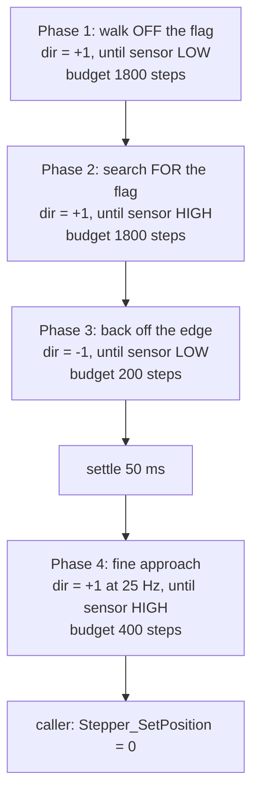

# 8. Motion planning and homing

`App/Src/motion_planner.c` is the only file that knows about both motors at
once, and the only place where "an angle" becomes "a number of microsteps."
This guide covers the three jobs it does beyond driver bring-up (which
[02-execution-flow.md](02-execution-flow.md) §2.3.1 already traced):

- turning an absolute disc angle into the shortest signed move (8.2–8.3);
- knowing which way "forward" physically turns each disc (8.4);
- finding the physical reference that makes an *absolute* angle mean anything
  at all — homing (8.5 onward).

## 8.1 The frames of reference

There are three, and every bug in this area is a confusion between two of
them:

| Frame | Unit | Who speaks it |
|---|---|---|
| Braille cell | 6-dot bitmask → per-disc *weight* | `braille_disc.c` |
| Disc angle | tenths of a degree, 0..3599 | `disk_angles_t`, `move_to_angle()` |
| Microsteps | signed pulse count, 1600 per revolution | `Stepper_t.position`, the STEP timers |

The angle frame exists so the character side never has to know about
microstepping: `braille_disc.c` computes "22.5°" and stays correct if the
TMC2209 is later reconfigured from 8 to 16 microsteps. Tenths of a degree,
rather than degrees, because every position on the discs is a multiple of
22.5° — a half-degree value that integer degrees could not hold.

One microstep is `3600 / 1600 = 2.25` tenths, i.e. **0.225°**, which is the
resolution the whole system works at. A disc position (22.5°) is exactly 100
microsteps apart from the next one, so nothing in the angle math ever needs
rounding to land on a position.

## 8.2 `steps_to_angle()` — shortest path on a circle

```c
static int32_t steps_to_angle(Stepper_t const *stepper, uint16_t angle_tenths) {
  int32_t const per_rev = (int32_t)APP_MICROSTEPS_PER_REV;          // 1600
  int32_t const target  = angle_tenths * APP_MICROSTEPS_PER_REV
                        / APP_ANGLE_TENTHS_PER_REV;                 // angle → steps

  int32_t current = Stepper_GetPosition(stepper) % per_rev;
  if (current < 0) { current += per_rev; }        // C's % keeps the sign

  int32_t delta = (target - current) % per_rev;
  if (delta >  per_rev / 2) { delta -= per_rev; } // more than half a turn ahead…
  else if (delta < -per_rev / 2) { delta += per_rev; }  // …go the other way
  return delta;
}
```

Three things are going on:

- **Absolute, not relative.** The caller passes "be at 45.0°", never "turn by
  45°". Position drift can therefore never accumulate over a long typing
  session: every character is re-referenced to the same zero.
- **The position counter is unbounded, the disc is not.** `position` keeps
  counting up (or down) across thousands of moves, so it is reduced modulo one
  revolution before comparison. The `current < 0` fixup exists because C's `%`
  keeps the sign of the dividend: `-1 % 1600` is `-1`, not `1599`.
- **Never turn more than half a turn.** A target 300° ahead is 60° behind, and
  the discs turn freely in both directions, so the planner takes whichever
  direction is shorter. That halves the worst-case latency per character (800
  microsteps, 0.5 s at `APP_STEP_RATE_HZ`) and, incidentally, halves the wear
  on the wiring loom.

## 8.3 `move_to_angle()` — both discs at once

```c
void move_to_angle(disk_angles_t disk_angle) {
  start_move(&stepper_motor_01, steps_to_angle(&stepper_motor_01, disk_angle.single_row_disc), APP_STEP_RATE_HZ);
  start_move(&stepper_motor_02, steps_to_angle(&stepper_motor_02, disk_angle.double_row_disc), APP_STEP_RATE_HZ);
  wait_until_idle();
}
```

`start_move()` splits the signed delta into a direction and a magnitude
(`Stepper_SetDirection` + `Stepper_MoveSteps`) and returns immediately, so
both trains are running before anything is waited on: a cell takes as long as
the *slower* disc, not the sum. A zero delta starts no train at all — a
character that only moves one disc leaves the other perfectly still rather
than nudging it.

`wait_until_idle()` then spins until neither stepper is busy. It is a busy-wait
on purpose: there is no scheduler to yield to, and the two flags it polls are
published by the timer ISRs (see [03-stepper-module.md](03-stepper-module.md)
§3.3). `APP_STEP_RATE_HZ` is derived from `APP_ROTATION_TIME_MS`, so the speed
reads as "one revolution per second" instead of as a bare 1600.

## 8.4 Which way is forward? (`invert_dir`)

Nothing above the stepper port has any opinion about the DIR pin's polarity —
the planner's whole vocabulary is "positive steps increase the angle." On this
board that invariant is only true because it is *made* true one layer down:
both discs are geared such that the direction the TMC2209 calls forward turns
them towards **decreasing** braille weight. So `motion_planner.c` declares the
board fact

```c
#define APP_MOTOR_DIR_INVERTED true
```

and passes it into `Stepper_Hal_Stm32_Init()` for both motors, where
`dir_write()` flips the level at the pin.

It is worth knowing what this looks like when it is *wrong*, because the
failure is systematic but not obviously directional. With the inversion
missing, every commanded angle θ is reached as −θ:

| Key | Commanded | Actually reached | Rendered as |
|---|---|---|---|
| `a` | single-row 22.5° (weight 1 = dot 1) | 337.5° ≡ 67.5° on a disc whose 4 positions repeat every 90° | weight 3 → dots 1 **and** 4 |
| `b` | single-row 22.5°, double-row 22.5° (weight 1 = dot 2) | 337.5° on both | weight 3 + weight 15 → all six dots |

Two lessons in that table. First, a mirrored disc does not read as "the
letters are backwards" — it reads as *different letters*, because the mirror
image of a position is another valid position. Second, the single-row disc
folds its four positions into a quarter turn
(`DISC1_ANGLE_TO_POS_ANG` takes the weight modulo 90.0°), so its errors alias
in a way the 16-position disc's don't.

This class of bug only became reproducible once homing existed: before that,
the position counter started from wherever the discs happened to be, so the
same defect looked like random dots rather than a consistent mirror.

## 8.5 Why homing is not optional

`Stepper_t.position` counts pulses; it has no idea where the disc physically
is. At power-up it is simply 0, whatever that happens to mean mechanically.
Since `move_to_angle()` is absolute, an unhomed disc renders every character
offset by the same unknown angle — which is to say, renders the wrong letter,
every time, consistently.

The fix is a physical reference: each disc carries a flag that passes over an
optical ZERO sensor once per revolution. `calibrate_zero_position()` drives
each disc until it finds that flag and then calls `Stepper_SetPosition()` to
declare the point angle 0.

Hardware side, for reference:

| Signal | Pin | Configured as |
|---|---|---|
| `ZERO_MOTOR01` | PA9 | input, **pull-down** |
| `ZERO_MOTOR02` | PA8 | input, **pull-down** |

The sensors read **high while the flag sits over them**. The pull-downs matter
for a specific failure mode: with a floating input, a disconnected or
unpowered sensor can read high from nothing but pin capacitance, and homing
would then "succeed" instantly at an arbitrary angle. Pulled down, a dead
sensor reads a steady low, the search exhausts its budget, and the fault is
reported instead of silently accepted.

## 8.6 The homing sequence

`home_disc()` is four calls to one primitive. `seek_sensor()` steps a disc one
microstep at a time in a given direction until the sensor reaches a wanted
level, giving up after a bounded number of steps:



Each phase answers a specific objection to the naive version ("turn until the
sensor goes high, call that zero"):

1. **Walk off the flag first.** A disc that powered up already sitting over
   its sensor would otherwise be zeroed wherever inside the sensor window it
   happened to stop — an error as wide as the flag itself, tens of degrees.
2. **Search for the flag** at seek speed. This is the phase that can legitimately
   need most of a revolution.
3. **Back off until the sensor releases.** Phase 2 stopped *somewhere* inside
   the sensor window, having entered it at seek speed. Backing out puts the
   disc just outside the same edge.
4. **Creep onto that same edge, from the same side, slowly.** This is what
   makes the reference repeatable: the trigger point is always approached in
   the same direction and at the same speed, so neither the sensor's
   hysteresis nor the arrival speed can shift it. Approaching an edge from
   both sides — which a naive routine does, depending on where it started —
   can move the detected zero by the whole width of the sensor's hysteresis
   band.

`APP_HOMING_SEARCH_DIR` and `APP_HOMING_BACKOFF_DIR` are the signs used above
(`+1` / `-1`, in the planner's own frame). Swapping the two reverses the
physical sweep, which parks zero on the *other* edge of the flag — a valid
thing to want, and the only thing you should have to change if the mechanics
are rebuilt mirror-image. They were flipped exactly once, when
`invert_dir` moved the polarity fix into the port, precisely so that the
physical sweep direction stayed the same.

## 8.7 The bounds, and why each one is what it is

Every constant is derived from a time or an angle rather than written as a
step count, so the whole table survives a change of microstepping:

| Constant | Value here | Derived from | Why |
|---|---|---|---|
| `APP_HOMING_SEEK_RATE_HZ` | 400 Hz | one rev per `APP_HOMING_SEARCH_TIME_MS` (4 s) | Keeps startup short while staying well inside the motor's torque; the sensor is sampled once per microstep, so speed costs no accuracy |
| `APP_HOMING_FINE_RATE_HZ` | 25 Hz | fixed | Slow enough to make the edge repeatable, but clear of the ≈15 Hz hardware floor below which the 16-bit timer cannot express a period at all (see [03](03-stepper-module.md) §3.6) |
| `APP_HOMING_SLACK_TENTHS` | 450 (45°) | angle | How far the back-off may travel looking for the release point, and the margin granted on top of a full revolution |
| `APP_HOMING_SLACK_STEPS` | 200 | 45° in microsteps | " |
| `APP_HOMING_SEARCH_STEPS` | 1800 | 1 rev + slack | A search that has turned a full revolution *plus* margin has missed the flag: the sensor is dead, miswired, or the disc is jammed |
| `APP_HOMING_APPROACH_STEPS` | 400 | 2 × slack | The fine approach must undo whatever the back-off travelled and still reach the edge, so it gets that budget twice over |
| `APP_HOMING_SETTLE_MS` | 50 | fixed | Lets the mechanics stop ringing after the direction reversal, before the measuring pass |
| `APP_ZERO_POSITION_STEPS` | 0 | — | The position assigned to a disc parked on its flag. Make it non-zero if a flag turns out not to sit on the disc's pattern origin |

**How long it takes.** Phases 1 and 2 are bounded at 4.5 s each; phase 3 at
0.5 s; phase 4 is the slow one — 400 microsteps at 25 Hz is 16 s in the worst
case, though it only has to walk back the distance phase 3 travelled, which is
the flag's entry depth plus hysteresis, typically a small fraction of that. The
two discs are homed sequentially, not concurrently. Budget several seconds of
startup for a healthy board, and note that the *worst* case is bounded rather
than fast: the design goal here is "never spin forever inside `App_init()`",
not "boot instantly".

Note also that every homing step is its own one-step `Stepper_MoveSteps()`
call, because the sensor has to be re-read between steps. Each of those
restarts the pulse train, so effective travel is slightly slower than the
nominal rate — fine for homing, and the reason homing rates are quoted as
budgets rather than promises.

## 8.8 When homing fails

`seek_sensor()` returns false only when its step budget ran out with the
sensor still in the wrong state. `home_disc()` propagates that, and
`calibrate_zero_position()` turns it into a diagnosis rather than a halt:

```c
if (home_disc(&stepper_motor_01, ZERO_MOTOR01_GPIO_Port, ZERO_MOTOR01_Pin)) {
  Stepper_SetPosition(&stepper_motor_01, APP_ZERO_POSITION_STEPS);
} else {
  blink_warning(APP_MOTOR_01_BLINK_CODE);   // 1 blink ×3 for motor 1, 2 for motor 2
  homed = false;
}
```

The failing disc keeps its old (meaningless) position rather than having a
wrong zero written into it, the other disc is still homed on its own merits,
and `App_init()` continues — deliberately, so the USB port comes up and you
can talk to the board while diagnosing the sensor. `App_run()` will then
happily render characters on a disc with no valid reference; that's the price
of not bricking startup, and the blink code is the warning.

A checklist for a disc that never homes:

1. **Is the sensor wired and powered?** With the pull-down, an open input
   reads a constant low, which looks exactly like "flag never arrives."
2. **Is the flag actually passing over the sensor?** Turn the disc by hand and
   watch PA9/PA8, or read the pin in the debugger.
3. **Is the disc turning at all?** A driver that never answered over UART
   still blinks its own code from `initialize_motors()`; two different faults
   share the same blink pattern, so check for that one first.
4. **Is the flag wider than 45°?** Phase 3's budget is
   `APP_HOMING_SLACK_TENTHS`; a flag whose window is wider than that will
   exhaust the back-off before releasing.

## 8.9 Testing this without the board

The homing logic is ordinary C over `Stepper_t` and two GPIO reads, so it can
be exercised on a host: build `stepper.c` against a fake HAL whose
`pulse_train_start()` immediately raises the requested
`Stepper_OnPulseComplete()` calls, and a `HAL_GPIO_ReadPin()` stub that models
a flag occupying a known arc of the disc. That is enough to assert the two
properties that matter and that are painful to check on hardware:
**repeatability** (homing from many different starting angles lands on the
same position) and **bounded failure** (a sensor stuck low returns false
instead of spinning forever). Both were verified that way before this routine
ever ran on the board.
