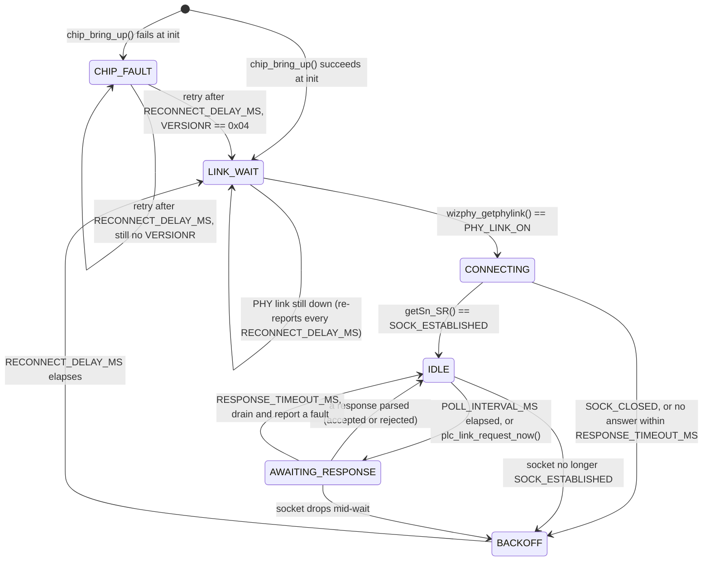

# 9. MODBUS TCP and the PLC link

This guide explains how the device talks to the PLC: why it is a client and
not a server, what a request and a response look like on the wire, why the
response parser rejects more than it has to, the `plc_link` state machine that
drives the W5500, and what to check when the SPI link will not come up.

Files to keep open while reading:

- [App/Src/plc_link.c](../App/Src/plc_link.c) — the state machine
- [App/Inc/plc_link.h](../App/Inc/plc_link.h) — its contract
- [App/Src/modbus_tcp.c](../App/Src/modbus_tcp.c) — the frame codec
- [App/Inc/modbus_tcp.h](../App/Inc/modbus_tcp.h) — frame layout constants
- [App/Inc/plc_config.h](../App/Inc/plc_config.h) — every timing and address
- [Lib/w5500/w5500_stm32.c](../Lib/w5500/w5500_stm32.c) — the SPI port
- [Lib/w5500/UPSTREAM.md](../Lib/w5500/UPSTREAM.md) — what was vendored and why

---

## 9.0 Short answers first

| Question | Answer |
|---|---|
| Is the device a MODBUS server? | No. It is **always the client**. It opens the TCP connection and sends every request; the PLC only ever replies. See 9.1. |
| Then how does it react to something changing on the PLC? | It doesn't, directly — it polls every `PLC_POLL_INTERVAL_MS` and compares. "The PLC sent new data" is really "the last poll's answer differs from what the reader is holding." See 9.1. |
| How big is one request/response? | A 12-byte request, an 11-byte response — one fixed-size transaction for the whole 11-coil package. See 9.2. |
| Why reject a response that decodes cleanly? | Because "decodes cleanly" and "answers the request we just sent" are different questions, and only the second one makes the values trustworthy. See 9.3. |
| What does `ETH_INT` (PB5) do? | Nothing, on purpose. See 9.6. |
| Has any of this run against a real W5500 or PLC? | No. See 9.8. |
| Can a busy main-loop pass make a poll or timeout run late? | Yes — roughly 1.5&nbsp;s of blocking in one pass is reachable. The constants stay correct anyway. See 9.10. |

---

## 9.1 The device is a client — and what that means for "unrequested" data

MODBUS TCP is a strict master/slave (client/server) protocol: the client sends
a request, the server sends back exactly one response, and the server has
**no mechanism to originate a message**. There is no MODBUS equivalent of a
push notification. If the original idea for this project was "the device
reacts when the PLC sends it something," that idea does not map onto MODBUS at
all — the PLC is a server here (see `PLC_SERVER_IP_*` /
[plc_config.h:54-58](../App/Inc/plc_config.h#L54-L58)), and a server can only
answer, never initiate.

So `plc_link.c` does the only thing a client can do: it asks, repeatedly.
Every `PLC_POLL_INTERVAL_MS` (500&nbsp;ms —
[plc_config.h:82](../App/Inc/plc_config.h#L82)) it sends the same Read Coils
request for the same 11 coils, whether or not anyone is reading the cell. When
a poll's answer differs from the package `reader_ui.c` currently holds, that
answer becomes the *pending* package and the "queued" sound plays; when it
matches, nothing happens at all. That comparison —
`plc_snapshot_equal()` — is the entire mechanism behind "the PLC sent
something": a background poll came back different from what the reader is
holding. The header comment on the module says this outright:

> "The device polls continuously rather than waiting to be told anything,
> because MODBUS gives a server no way to push to a client."
> — [plc_link.c:6-10](../App/Src/plc_link.c#L6-L10)

Two consequences fall out of this:

- **Nothing is instantaneous.** A change on the PLC is invisible to the
  device until the next poll lands — up to 500&nbsp;ms of latency, plus
  however long the reply takes to arrive.
- **There is no such thing as an update that got lost.** Since the device
  never trusts a single stale answer to still be current, it just asks again
  in half a second. A dropped or slow reply costs latency, not correctness.

## 9.2 A MODBUS TCP frame, byte by byte

Every MODBUS TCP frame is a 7-byte **MBAP header** (transaction id, protocol
id, length, unit id) followed by a **PDU** (function code plus payload). This
firmware only ever builds one kind of request and parses one kind of
response, both fixed size because `PLC_COIL_COUNT` (11) never changes at
runtime. The offsets below are `modbus_build_read_coils()`'s and
`modbus_parse_read_coils()`'s `MB_OFF_*` constants
([modbus_tcp.c:12-30](../App/Src/modbus_tcp.c#L12-L30)).

**Request — 12 bytes, built by [modbus_build_read_coils()](../App/Src/modbus_tcp.c#L42-L66):**

| Offset | Bytes | Field | Value for this project |
|---|---|---|---|
| 0–1 | 2 | Transaction ID | incremented per request, wraps (`++link.transaction_id`, [plc_link.c:129](../App/Src/plc_link.c#L129)) |
| 2–3 | 2 | Protocol ID | `0x0000`, always |
| 4–5 | 2 | Length | `0x0006` — bytes from Unit ID onward that follow |
| 6 | 1 | Unit ID | `0x01` (`PLC_UNIT_ID`) |
| 7 | 1 | Function code | `0x01` (Read Coils) |
| 8–9 | 2 | Start address | `0x0000` (`PLC_COIL_BASE_ADDRESS`) |
| 10–11 | 2 | Quantity | `0x000B` (11, `PLC_COIL_COUNT`) |

**Response — 11 bytes, validated by [modbus_parse_read_coils()](../App/Src/modbus_tcp.c#L68-L129):**

| Offset | Bytes | Field | Value for this project |
|---|---|---|---|
| 0–1 | 2 | Transaction ID | must echo the request's, or the frame is rejected (9.3) |
| 2–3 | 2 | Protocol ID | must be `0x0000` |
| 4–5 | 2 | Length | `0x0005` — Unit ID + FC + byte count + 2 data bytes |
| 6 | 1 | Unit ID | must be `0x01` |
| 7 | 1 | Function code | `0x01`, or `0x81` (`0x01 \| MODBUS_EXCEPTION_FLAG`) for an exception |
| 8 | 1 | Byte count | `0x02` — `MODBUS_COIL_BYTES(11)` = `(11+7)/8` |
| 9 | 1 | Data byte 0 | coils 0–7; bit 0 is coil 0, the LSB-first bit order Read Coils always uses |
| 10 | 1 | Data byte 1 | coils 8–10 in bits 0–2; bits 3–7 are padding |

The 11-byte response is also the shortest legal one for this quantity
(`MODBUS_READ_COILS_RSP_LEN(11)`,
[modbus_tcp.h:41-42](../App/Inc/modbus_tcp.h#L41-L42)) — Read Coils has no
trailer, so once the byte count is known the frame length is fixed. Padding in
byte 10's top five bits is not data: `modbus_parse_read_coils()` masks it off
before returning the bits
([modbus_tcp.c:122-126](../App/Src/modbus_tcp.c#L122-L126)), so a slave that
sets those bits to something other than zero cannot invent an extra signal.

## 9.3 Why the parser is strict

`modbus_parse_read_coils()` rejects a frame for any of nine reasons
(`modbus_status_t`,
[modbus_tcp.h:44-56](../App/Inc/modbus_tcp.h#L44-L56)) — too short, wrong
protocol id, wrong transaction id, wrong unit id, a length field that
disagrees with what actually arrived, not a Read Coils reply, a wrong byte
count, an exception response, or a null/out-of-range argument. Most of these
guard against a frame that is simply broken. The transaction id check guards
against something more dangerous: **a frame that is not broken at all.**

Only one request is ever outstanding — `send_request()` is called only from
the `IDLE` state's handler
([plc_link.c:296-305](../App/Src/plc_link.c#L296-L305)), and sending moves the
link straight to `AWAITING_RESPONSE`, so nothing can trigger a second request
until a response or a timeout brings the link back to `IDLE`. The explicit
out-of-cycle trigger respects this too: `plc_link_request_now()` refuses to
set `poll_requested` while the link is already `AWAITING_RESPONSE`
([plc_link.c:231-235](../App/Src/plc_link.c#L231-L235)). But a timeout does
not mean the PLC gave up; it means the reply did not arrive in time. Suppose
it shows up a moment later, just as the next poll's request and reply are also
in flight. Without something to distinguish "the answer to the request I just
sent" from "the answer to the request before that," the two replies sitting
back-to-back in the TCP stream would be indistinguishable from one correct
reply followed by framing garbage — or worse, `recv()` could return them
concatenated and the parser would have no way to know a second frame started
partway through the buffer it was given.

This is exactly the failure the transaction id defends against. A reply to an
earlier request has the right protocol id, the right unit id, the right
length field, the right function code, the right byte count — it decodes
*perfectly*. The only thing wrong with it is that it answers a question that
is no longer the current one, and only the transaction id says so
([modbus_tcp.c:85-87](../App/Src/modbus_tcp.c#L85-L87)). Without that check,
the reader would be shown values that were true half a second ago, with
nothing in the response itself to indicate anything had gone wrong — the
exact silent-corruption scenario a strict client protects against.

`plc_link.c` does not lean on the transaction id alone, though: every path
that gives up on a request —
[a backlog too large to be a single frame](../App/Src/plc_link.c#L171-L179),
[a frame that failed validation](../App/Src/plc_link.c#L193-L203), or
[a request that timed out](../App/Src/plc_link.c#L316-L328) — calls
`drain_socket()` before returning to `IDLE`, specifically so a late reply
cannot still be sitting in the buffer to confuse the *next* request. See 9.7.

## 9.4 The `plc_link` state diagram

What each state is actually waiting for
([plc_link.c:243-341](../App/Src/plc_link.c#L243-L341)):

| State | Waiting for |
|---|---|
| `CHIP_FAULT` | `RECONNECT_DELAY_MS`, then retries `chip_bring_up()` — a wiring/power problem, not a network one |
| `LINK_WAIT` | `wizphy_getphylink() == PHY_LINK_ON` — a cable that is plugged in and negotiated |
| `CONNECTING` | `getSn_SR()` to report `SOCK_ESTABLISHED` (the non-blocking `connect()` finishing) |
| `IDLE` | `POLL_INTERVAL_MS` to elapse, or an out-of-cycle request from the reader |
| `AWAITING_RESPONSE` | enough bytes in the socket to parse a full response, or `RESPONSE_TIMEOUT_MS` |
| `BACKOFF` | `RECONNECT_DELAY_MS`, then starts over from `LINK_WAIT` |

Every failure path funnels through `fail_to_backoff()`
([plc_link.c:86-90](../App/Src/plc_link.c#L86-L90)), which closes the socket,
reports the fault, and re-enters from `LINK_WAIT`. That is deliberate: a
failure during `CONNECTING` and a failure during `AWAITING_RESPONSE` are
handled by the same three lines of code, so the recovery path is exercised by
every kind of failure rather than only the one whoever wrote it happened to
be thinking about.

One naming note if you go looking in ioLibrary's headers: the non-blocking
`connect()` call at `LINK_WAIT → CONNECTING`
([plc_link.c:269](../App/Src/plc_link.c#L269)) is not a plain function in the
vendored revision. `socket.h` defines `connect_W5x00()` and `connect_W6x00()`
and picks between them with a variadic dispatch macro, so a three-argument
call resolves to `connect_W5x00()` — see
[UPSTREAM.md:72-89](../Lib/w5500/UPSTREAM.md#L72-L89). Grepping the header for
`int8_t connect(` will not find it, and its address cannot be taken as a
function pointer.

## 9.5 The vendoring decision: `Ethernet/` only

`Lib/w5500/ioLibrary/` contains exactly `Ethernet/wizchip_conf.{c,h}`,
`Ethernet/socket.{c,h}`, `Ethernet/W5500/w5500.{c,h}`, and the upstream
license file — nothing else. ioLibrary upstream also ships an `Internet/`
tree (DHCP, DNS, SNTP, HTTP, FTP) and driver directories for five other
WIZnet chips. All of it was left out on purpose
([UPSTREAM.md:9-20](../Lib/w5500/UPSTREAM.md#L9-L20)):

- This device has one fixed static address
  ([plc_config.h:34-47](../App/Inc/plc_config.h#L34-L47)) and speaks nothing
  but MODBUS TCP. DHCP, DNS, SNTP, HTTP and FTP would never be called —
  `Internet/` would be dead code on a part with 64&nbsp;KB of flash to spend.
- This board only ever has a W5500 wired to it, so the W5100/W5100S/W5200/
  W5300/W6100/W6300 drivers would be dead code too.

The chip and SPI-framing selection macros the remaining files need
(`_WIZCHIP_=W5500`, `_WIZCHIP_IO_MODE_=_WIZCHIP_IO_MODE_SPI_VDM_`) are set as
`PUBLIC` compile definitions in
[Lib/w5500/CMakeLists.txt:14-22](../Lib/w5500/CMakeLists.txt#L14-L22) rather
than edited into the vendored header, which stays byte-for-byte what was
fetched — both macros are already `#ifndef`-guarded upstream, so the compile
definition pre-empts the header's own default instead of colliding with it.

## 9.6 `ETH_INT` (PB5): wired, owned, deliberately unused

`ETH_INT` is a real signal — the W5500 asserts it on socket events — and it
is wired to PB5, configured for a falling-edge interrupt, and shares
`EXTI9_5_IRQn` with the three buttons
([gpio.c:113-117](../Core/Src/gpio.c#L113-L117),
[stm32f1xx_it.c:222-230](../Core/Src/stm32f1xx_it.c#L222-L230)).
`plc_link_on_exti()` exists and is called from the shared handler
([app_main.c:118-121](../App/Src/app_main.c#L118-L121)). And yet nothing
reads the flag it sets:

> "Nothing consumes `irq_pending`: this tick runs on every main-loop pass, so
> `read_response()` below is already as prompt as an interrupt could make
> it." — [plc_link.c:308-310](../App/Src/plc_link.c#L308-L310)

`plc_link_tick()` runs once per `App_run()` pass with nothing else in the
loop that blocks for long (buttons and the sequencer are both cheap; the
disc move and the buzzer are the only blocking calls, and neither runs inside
`plc_link_tick()`). So the socket is serviced as promptly as an interrupt
could arrange for it to be serviced — there is no wait for `ETH_INT` to
short-circuit. Consistent with that, the W5500's `SIMR`/`Sn_IMR` interrupt
mask registers are left at their reset value (masked), so the pin is never
actually driven. The full reasoning, including why this is a decision and not
an oversight, is in the header:
[plc_link.h:71-87](../App/Inc/plc_link.h#L71-L87).

The point of wiring and owning a pin that gates nothing is that it has
somewhere to start from: a future interrupt-driven or low-power revision
needs a declared owner on `EXTI9_5`, not a pin nobody claims. A flag that
gated nothing behind a comment merely *claiming* it was an optimisation would
be worse than not having one — this section exists so that claim has
something to point at, and so it gets revisited if the reasoning above stops
being true.

## 9.7 `drain_socket()`: resynchronising a stream that lost its frame boundary

The least obvious function in `plc_link.c` is
[drain_socket()](../App/Src/plc_link.c#L146-L164): sixteen lines that read
and discard whatever is queued on the socket, up to `PLC_DRAIN_MAX_CHUNKS`
chunks. It exists because TCP is a byte stream, not a message stream — once
the receiver's idea of "where the next frame starts" is wrong, nothing about
a healthy TCP connection fixes that on its own. Three call sites lose that
alignment, each for a different reason:

- **An oversized backlog**
  ([plc_link.c:171-179](../App/Src/plc_link.c#L171-L179)) — more bytes are
  queued than the 32-byte frame buffer can hold, which cannot happen from one
  well-formed 11-byte response, so whatever is there is not a single frame
  worth parsing.
- **A frame that fails validation**
  ([plc_link.c:193-203](../App/Src/plc_link.c#L193-L203)) — the response
  itself may be the desync, or may be trailing bytes left over from an
  earlier one; either way there is nothing safe to assume about where the
  next frame begins.
- **A request that timed out**
  ([plc_link.c:316-328](../App/Src/plc_link.c#L316-L328)) — the reply may
  still arrive after the deadline, and if it does, it must not be left
  sitting in the buffer to merge with the *next* request's reply (9.3).

Every one of these paths keeps the TCP connection itself open — only the
buffered bytes are discarded, and the socket goes back to `IDLE` rather than
`BACKOFF`. Reopening the connection would be a much bigger hammer for a
problem that a byte-level resync already solves, and the case for treating it
as a connection failure that time is a real disconnect: `fail_to_backoff()`
handles that separately (9.4).

## 9.8 What has actually been verified

The host test suites cover 261 checks across four suites (`braille_disc`,
`plc_packet`, `modbus_tcp`, `reader_ui`), all pure logic run on a development
machine with no STM32 toolchain involved. Of the material in this guide, that
means **`modbus_tcp.c`'s codec is host-tested** — the request builder, every
`modbus_status_t` rejection path, and bit extraction across all 11 coils.

**`plc_link.c` and the W5500 SPI port (`Lib/w5500/w5500_stm32.c`) have had no
execution at all.** They cannot be — they need a real W5500, a real cable, and
a real PLC to do anything, and none of those has been connected yet. What
stands behind this section of the guide is careful reading of the vendored
headers against this code (`Lib/w5500/UPSTREAM.md`) and static review, not a
test run. Treat the state diagram in 9.4 as *intended* behaviour, verified by
inspection, until the checklist in
[11-hardware-bring-up.md](11-hardware-bring-up.md) has actually been run
against hardware.

## 9.9 Troubleshooting: proving the SPI link

`VERSIONR` reads `0x04` on every real W5500, so reading it back is the
cheapest possible end-to-end check of chip select, clock polarity, bit order
and wiring together — before any of it is buried under the state machine
above. `chip_bring_up()` already does this check on every bring-up and retry
([plc_link.c:106-108](../App/Src/plc_link.c#L106-L108)); if the device is
stuck cycling `CHIP_FAULT` (blink code `FAULT_LED_CODE_ETHERNET`, 3 blinks —
[fault_led.h:32](../App/Inc/fault_led.h#L32)), work through it in this order:

1. **All zeroes or all ones read back** — confirm `ETH_NSS` (PB12) actually
   toggles, and that the module has 3.3&nbsp;V and a solid ground back to the
   board.
2. **Nothing at all** — confirm `ETH_RESET` (PA10) goes low, then high;
   `w5500_stm32_hard_reset()` holds it low for `PLC_W5500_RESET_LOW_MS`
   (2&nbsp;ms) and waits `PLC_W5500_BOOT_MS` (10&nbsp;ms) after release
   ([plc_config.h:85-86](../App/Inc/plc_config.h#L85-L86)) — the chip stays
   held in reset without this.
3. **Garbled** — SPI2 is configured mode 0 (`CPOL` low, `CPHA` 1st edge),
   MSB-first, which is what the W5500 wants ([spi.c:44-48](../Core/Src/spi.c#L44-L48)).
   Confirm nothing has changed that.
4. **Intermittent** — SPI2 runs at 12&nbsp;Mbit/s
   (`SPI_BAUDRATEPRESCALER_2`, [spi.c:47](../Core/Src/spi.c#L47)); long
   jumper leads do not carry that reliably. Dropping to `_4` (6&nbsp;Mbit/s)
   is a one-line CubeMX change if this is the symptom.

Beyond the chip itself, the states in 9.4 map each link problem to a
specific symptom: `LINK_WAIT` that never advances means an unplugged or
unnegotiated cable; repeated `BACKOFF` after `CONNECTING` means the PLC is
not answering on `PLC_SERVER_IP_0-3`:`PLC_SERVER_PORT`
([plc_config.h:54-59](../App/Inc/plc_config.h#L54-L59)) — check the PLC is
actually listening on port 503, not the MODBUS default of 502; and a link
that connects but keeps reporting `LINK_FAULT` on the reader without ever
settling means responses are arriving but failing validation (9.3) — worth
capturing a frame on the wire and checking it against 9.2's byte tables.

## 9.10 The timing constants are floors, not guarantees

`PLC_POLL_INTERVAL_MS` (500&nbsp;ms,
[plc_config.h:82](../App/Inc/plc_config.h#L82)) and
`PLC_RESPONSE_TIMEOUT_MS` (1000&nbsp;ms,
[plc_config.h:83](../App/Inc/plc_config.h#L83)) read like a cadence the link
keeps to, but `plc_link_tick()` only runs as often as `App_run()` reaches it,
and `App_run()` is one cooperative pass with no preemption
([app_main.c:97-109](../App/Src/app_main.c#L97-L109)). Three calls reachable
from that pass block for real time before returning, and none of them run
inside `plc_link_tick()` itself:

- **A disc move.** `braille_render_char()`/`braille_render_dots()`
  ([braille_disc.c:245-259](../App/Src/braille_disc.c#L245-L259)) call
  `move_to_angle()`
  ([motion_planner.c:196-204](../App/Src/motion_planner.c#L196-L204)), which
  busy-waits until both discs stop turning — about a second, the same figure
  the module header already budgets for
  ([app_main.c:12-14](../App/Src/app_main.c#L12-L14); see also
  [10-reader-ui-and-buzzer.md §10.5](10-reader-ui-and-buzzer.md#105-why-the-buzzer-blocks-and-the-five-patterns)).
- **The fault tone.** `buzzer_play()`
  ([buzzer.c:153-163](../App/Src/buzzer.c#L153-L163)) calls `HAL_Delay()` per
  step; the `LINK_FAULT` pattern is the longest of the five, at
  480&nbsp;ms (10.5).
- **The W5500 hard reset.** `chip_bring_up()`
  ([plc_link.c:95-126](../App/Src/plc_link.c#L95-L126)) calls
  `w5500_stm32_hard_reset()` at
  [plc_link.c:103](../App/Src/plc_link.c#L103), about 12&nbsp;ms
  (`PLC_W5500_RESET_LOW_MS` + `PLC_W5500_BOOT_MS`, 9.9). This one only runs on
  the first bring-up and on every `CHIP_FAULT` retry
  ([plc_link.c:245-253](../App/Src/plc_link.c#L245-L253)), not on every pass.

These can share a single `App_run()` pass. Buttons are serviced first
([app_main.c:97-101](../App/Src/app_main.c#L97-L101)), so a press that lands
on a render can already have cost close to a second before
`plc_link_tick()` even runs; if that same tick calls `report_fault()` on a
fault path ([plc_link.c:77-81](../App/Src/plc_link.c#L77-L81)) and
`reader_ui_on_link_fault()` plays the tone in response
([reader_ui.c:208-219](../App/Src/reader_ui.c#L208-L219)), the pass has
blocked for roughly 1.5&nbsp;s before `reader_ui_tick()` even runs — against
a 500&nbsp;ms poll interval and a 1000&nbsp;ms response deadline that assume
nothing else is happening. The two constants are therefore a floor on how
soon the next poll or timeout check *can* run, not a promise of when it
*will*.

Two properties of the surrounding code are what make that a non-issue rather
than a latent bug:

- Every deadline in `plc_link.c` and `reader_ui.c` is an unsigned
  `HAL_GetTick()` difference —
  [elapsed_since()](../App/Src/plc_link.c#L72-L75) and
  [elapsed()](../App/Src/reader_ui.c#L60-L64) both compute
  `(uint32_t)(now - since) >= interval`. A pass that runs long does not skip
  a deadline: the next tick simply sees an elapsed time already past the
  interval and acts on it immediately, wrap-around included.
- `read_response()` is called before the `AWAITING_RESPONSE` timeout is even
  checked ([plc_link.c:315-317](../App/Src/plc_link.c#L315-L317)): a reply
  that arrived while the pass was blocked elsewhere gets parsed and accepted
  right there, and the timeout check below it never runs. A late pass can
  delay when a response is read, but it can never turn an already-arrived,
  valid response into a spurious timeout.

So a 1.5&nbsp;s pass costs latency, not correctness: every deadline still
fires, just later than the raw constants suggest, and the reader eventually
sees either the data or a fault, never a wrong answer.

---

**Previous:** [08-motion-and-homing.md](08-motion-and-homing.md) ·
**Next:** [10-reader-ui-and-buzzer.md](10-reader-ui-and-buzzer.md) ·
**Index:** [README.md](README.md)
